# Trace Request Workflow

## When to Use

Use this workflow when:
- ✅ Debugging why an endpoint behaves unexpectedly
- ✅ Understanding how data flows through the system
- ✅ Onboarding and learning the codebase
- ✅ Documenting existing functionality

Do NOT use when:
- ❌ Adding new functionality → Use `/plan-feature` or `/add-endpoint`
- ❌ Checking architecture patterns → Use `/audit-module`

---

Use this workflow to understand how a request flows through the system.

## 1. Input

What endpoint are you tracing?
- Method: (GET/POST/PATCH/DELETE)
- Path: (e.g., `/api/v1/jobs/:id`)

## 2. Find Route Handler

// turbo
```bash
grep -r "METHOD.*PATH" apps/backend/src/app/http/routes/
```

Example:
```bash
grep -r "post.*/:jobId/schedule" apps/backend/src/app/http/routes/
```

Read the matched route file to see the handler.

## 3. Identify Use-Case

In the route handler, look for:
```typescript
container.{module}.useCases.{entity}.{action}.execute(...)
```

Example findings:
- `container.compliance.useCases.jobs.schedule.execute()`
- Module: `compliance`
- Entity: `jobs`  
- Action: `schedule`

## 4. Read Use-Case

Navigate to the use-case:
```
apps/backend/src/modules/{module}/application/{entity}/{ActionUseCase}.ts
```

Or use NAVIGATION.md:
// turbo
```bash
cat apps/backend/src/modules/{module}/NAVIGATION.md
```

## 5. Identify Repository Calls

In the use-case, look for:
```typescript
this.{repository}.{method}(...)
```

List all repository methods called:
| Repository | Method | Purpose |
|------------|--------|---------|
| ... | ... | ... |

## 6. Check for Cross-Module Dependencies

Look for injected dependencies:
```typescript
constructor(
    private jobs: JobRepository,
    private forms: FormRepository,  // Cross-entity
    private otherModule: OtherPort, // Cross-module
) {}
```

## 7. Generate Flow Diagram

Create a mermaid diagram:

```mermaid
sequenceDiagram
    participant Client
    participant Route as routes/{group}/routes.ts
    participant UC as {ActionUseCase}
    participant Repo as {Repository}
    participant DB as PostgreSQL

    Client->>Route: METHOD /api/v1/path
    Route->>Route: authenticate()
    Route->>Route: validateRequest()
    Route->>UC: execute(params)
    UC->>Repo: findById(id)
    Repo->>DB: SELECT
    DB-->>Repo: row
    Repo-->>UC: entity
    UC->>Repo: update(id, data)
    Repo->>DB: UPDATE
    DB-->>Repo: success
    Repo-->>UC: updatedEntity
    UC-->>Route: result
    Route-->>Client: { success: true, data }
```



## 8. Output Summary

```markdown
# Request Flow: [METHOD] [PATH]

## Layers Traversed

| Layer | File | Function |
|-------|------|----------|
| Route | routes/{group}/routes.ts | handler |
| Middleware | middleware/auth.ts | authenticate, requireRoles |
| Use-Case | modules/{module}/application/{Action}UseCase.ts | execute |
| Repository | modules/{module}/adapters/drizzle/{Repo}.ts | methods |
| Database | infrastructure/db/schema/{table}.ts | table |

## Data Transformations

| Stage | Shape |
|-------|-------|
| Request body | { field: value } |
| Use-case input | validated DTO |
| Repository call | entity |
| Response | { success, data } |

## Side Effects

- [ ] Database writes: [list]
- [ ] Emails sent: [list]
- [ ] External API calls: [list]

## Error Paths

| Condition | Error | HTTP Status |
|-----------|-------|-------------|
| Not found | NotFoundError | 404 |
| Invalid input | ValidationError | 400 |
| Unauthorized | UnauthorizedError | 401 |
```
