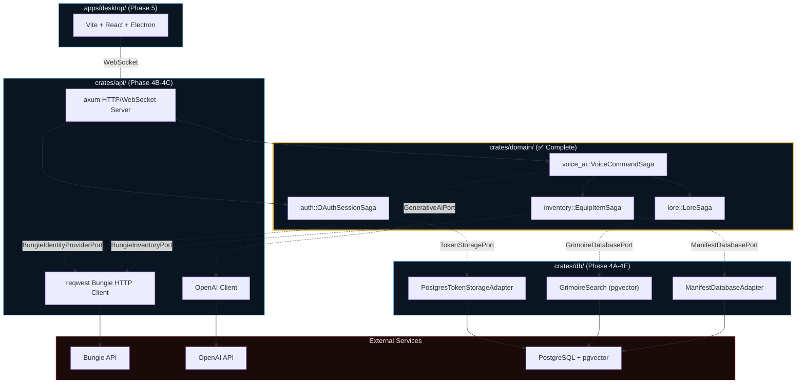
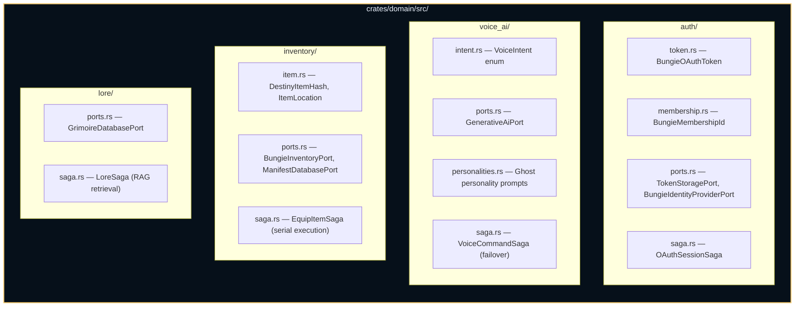

# Destiny AI Ghost Companion — Onboarding Guide

Welcome! If you are reading this, you are taking over the repository after a massive architectural pivot.

While you originally built the foundation and database for the previous version of this project, **the architecture has been completely migrated to Enterprise Rust.**

This document will catch you up on exactly what changed, why it changed, and how the codebase is fundamentally structured today so you can hit the ground running in Phase 4.

---

## 1. Old vs New: File Structure Migration

The repository was completely restructured from a Python monolith into a Rust workspace with strict Domain-Driven Design boundaries.

```mermaid
graph LR
    subgraph OLD["❌ OLD Structure (Python Monolith)"]
        direction TB
        A1["server.py (83K lines)"]
        A2["ghost/assistant.py (287K)"]
        A3["ghost/auth.py"]
        A4["ghost/bungie.py"]
        A5["ghost/lore.py"]
        A6["ghost/ollama.py"]
        A7["ghost/grok.py"]
        A8["launch.py"]
        A9["frontend/ (CRA React)"]
        A10["webapp/index.html"]
    end

    subgraph NEW["✅ NEW Structure (Rust Workspace)"]
        direction TB
        B1["crates/domain/ (Pure Logic)"]
        B2["crates/db/ (Postgres Adapters)"]
        B3["crates/api/ (HTTP + WebSocket)"]
        B4["apps/desktop/ (Vite+Electron)"]
        B5["docs/roadmap/ (Phase Trackers)"]
        B6["docs/adr/ (16 ADRs)"]
    end

    OLD -->|"Refactored Into"| NEW

    style OLD fill:#1a0a0a,stroke:#ff9a9a,color:#ffd9d9
    style NEW fill:#0a1a0a,stroke:#80e2ff,color:#edf4ff
```



### What Moved Where

| Old File | New Location | What Changed |
|:---------|:-------------|:-------------|
| `ghost/auth.py` | `crates/domain/src/auth/` | XOR encryption → Bungie OAuth2 SSO via ports |
| `ghost/assistant.py` | `crates/domain/src/voice_ai/` | 287K monolith → `VoiceCommandSaga` with failover circuit |
| `ghost/bungie.py` | `crates/domain/src/inventory/` | Raw HTTP → `EquipItemSaga` with serial execution |
| `ghost/lore.py` | `crates/domain/src/lore/` | Text file parsing → RAG via `GrimoireDatabasePort` |
| `ghost/ollama.py` + `grok.py` | `crates/domain/src/voice_ai/ports.rs` | Hardcoded APIs → Universal `GenerativeAiPort` trait |
| `server.py` | `crates/api/` (Phase 4C) | Monolithic Flask → `axum` WebSocket server |
| `frontend/` | `apps/desktop/` (Phase 5A) | CRA React → Vite + React + Electron |
| `webapp/index.html` | Harvested in Phase 5B | Design tokens extracted into reusable components |

---

## 2. Architecture: How the Crates and Apps Connect



> **Key Rule:** Solid arrows = direct calls. Dashed arrows = trait boundaries (Ports). The Domain layer (`crates/domain/`) NEVER imports `reqwest`, `sqlx`, or any infrastructure crate. It only talks to traits.

---

## 3. The Domain Layer (`crates/domain/` — ✅ Complete)

The core of the application is split into four Bounded Contexts:



---

## 4. Infrastructure: Docker & PostgreSQL (Phase 4)

The backend runs in Docker with PostgreSQL (+ `pgvector` for semantic search). The infrastructure is broken into 5 vertical slices in `docs/roadmap/PHASE_4_Infrastructure/`.

Your workflow is:
1. Open `PHASE_4A_Local_Foundation.md` → hand to your agent → verify.
2. Open `PHASE_4B_Auth_Slice.md` → hand to your agent → verify.
3. Repeat through 4C, 4D, 4E.

Each phase document tells the agent **exactly** which Rust traits to implement, which Bungie API endpoints to hit, and which ADRs constrain the design.

---

## 5. Presentation: Electron + Web (Phase 5)

Phase 5 builds the user-facing application from `apps/desktop/` using Vite + React + Electron. It ships as both a `.exe` desktop app and a web version. Broken into 6 slices in `docs/roadmap/PHASE_5_Presentation/`.

The existing `webapp/index.html` contains a **production-quality Destiny 2 design system** (glassmorphism, radial gradients, chat bubbles). Phase 5B harvests those CSS tokens into reusable React components.

---

## 6. Critical ADRs (Read `docs/adr/`)

| ADR | Title | Why It Matters |
|:----|:------|:---------------|
| 005 | Delegated Authentication | No passwords. 100% Bungie OAuth2 SSO. |
| 007 | Universal OpenAI LLM Adapter | Any OpenAI-compatible API (Ollama, Grok) via configurable base URL. |
| 010 | Strict Serial Inventory Mutations | Never `tokio::join!` Bungie requests. 25 req/sec rate limit. |
| 011 | Inventory Saga State Rollbacks | Graceful error messages at every failure point. |
| 014 | Lore Async Memory Caching | Manifest cached and refreshed asynchronously. |
| 015 | Lore Manifest Semantic Search | RAG pipeline against the official Bungie Manifest. |

---

## 7. Quick Reference

| What | Where |
|:-----|:------|
| Master Roadmap | `docs/roadmap/DESTINY_GHOST_ROADMAP.md` |
| Phase 4 Plans | `docs/roadmap/PHASE_4_Infrastructure/` |
| Phase 5 Plans | `docs/roadmap/PHASE_5_Presentation/` |
| Domain Source | `crates/domain/src/` |
| ADRs | `docs/adr/` |
| Commit Format | `docs/development/COMMITS.md` |
| Test Strategy | `docs/development/TEST_STRATEGY.md` |
| Design Worksheets | `docs/design-worksheets/` |

---

## 8. Agent Workflows (`.cortex/workflows/`)

These are slash commands you can invoke in your AI coding agent. They automate repetitive engineering processes. Here are the most important ones, organized by when you'll use them.

### 🟢 Every Session
| Workflow | When to Run | What It Does |
|:---------|:------------|:-------------|
| `/start-work` | **First thing, every session** | Checks git status, identifies your branch, loads context. |
| `/onboard` | **First session on this repo** | Full context recovery — reads roadmap, ADRs, and domain code. |
| `/commit` | **Before every commit** | Formats a Conventional Commit with the correct scope. |

### 🔵 Starting & Finishing Phase Work
| Workflow | When to Run | What It Does |
|:---------|:------------|:-------------|
| `/start-subphase` | **When opening a new Phase (e.g., 4A)** | Scaffolds the 4-artifact lifecycle: journal entry, implementation matrix, and working checklist. |
| `/maintain-subphase` | **During active work on a phase** | Updates the journal, checks off matrix items, runs mid-session audits. |
| `/finish-subphase` | **When a phase's verification checks all pass** | Runs a spec audit, generates a traceability proof, and marks the phase complete in the roadmap. |

### 🟡 Quality Gates (Run After Major Changes)
| Workflow | When to Run | What It Does |
|:---------|:------------|:-------------|
| `/audit-crate` | **After adding files to a crate** | Audits `crates/db/` or `crates/api/` for internal structure compliance. |
| `/audit-hexagonal` | **After implementing an adapter** | Verifies the crate respects hexagonal boundaries (no domain imports in infrastructure, no `reqwest` in domain, etc.). |
| `/adr-check` | **After making a design decision** | Scans the conversation for implicit decisions that should be captured as an ADR. |
| `/adr-capture` | **When you decide to record an ADR** | Generates a draft ADR document from the current conversation context. |

### 🟣 Documentation
| Workflow | When to Run | What It Does |
|:---------|:------------|:-------------|
| `/pda-during-implementation` | **While building Phase 4/5** | Populates DDD module design docs and maintains the Change Log Directory. |
| `/pda-sync-feature` | **After completing a single feature** | Lightweight sync of DDD docs for just one feature. |
| `/doc-audit` | **Periodically** | Finds stale or missing documentation across the repo. |
| `/log-feature` | **After completing a feature** | Logs the completion in the daily journal (`docs/journal/`). |
| `/trace-request` | **When debugging or verifying a flow** | Traces a request from the frontend through axum → domain saga → port → adapter → external API. |

### 📋 Advanced (Spec & Traceability)
| Workflow | When to Run | What It Does |
|:---------|:------------|:-------------|
| `/create-implementation-matrix` | **At start of a phase** | Creates a comprehensive checklist matrix mapping every deliverable. |
| `/create-spec-audit` | **At end of a phase** | Audits code against the spec to catch drift. |
| `/create-traceability-matrix` | **At end of a phase** | Creates an end-to-end trace from requirement → ADR → code → test. |
| `/design-module` | **Before implementing a new bounded context** | Generates a learning-focused design worksheet. |

### Typical Phase 4 Session Flow
```
/start-work          → Load context, check branch
/start-subphase      → Scaffold Phase 4A artifacts
  ... implement ...
/commit              → Commit with proper scope
/audit-crate         → Verify crate structure
/audit-hexagonal     → Verify port boundaries
/adr-check           → Catch any undocumented decisions
/maintain-subphase   → Update journal and matrix
  ... more work ...
/finish-subphase     → Close out Phase 4A, run spec audit
/log-feature         → Log in daily journal
```

---

Welcome back to the Ghost Companion. Eyes up, Guardian.
