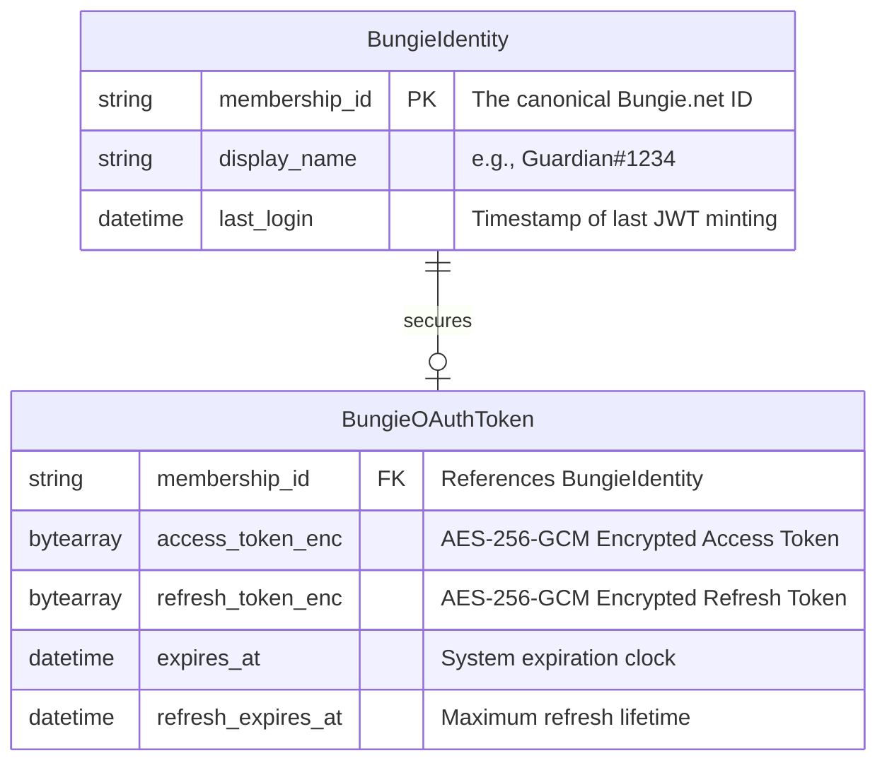

# Entity-Relationship Diagram: Auth Bounded Context

## Context
This diagram represents the strict relational database schema explicitly designed for the `auth` domain slice, governed by **ADR 005 (Frictionless SSO)**. Because there are no local passwords or emails, the database operates solely as a proxy mapping cache for Bungie.net profiles.

## Diagram

## Security Invariants
1. **Separation of Secrets:** Identifiable public data (`display_name`) is stored in `BungieIdentity` to be safely read by frontend profiles. Highly sensitive tokens are shoved into a 1:1 mapped separate table `BungieOAuthToken` to prevent accidental `SELECT * FROM` leakage.
2. **AES-GCM Requirement:** As defined by the Data Structure rules, the `_enc` fields in the database are stored as Raw BLOBs (byte arrays). They are physically unreadable if the `.sqlite` or Postgres row is compromised, because the Rust backend holds the decryption key in memory, outside the database.
