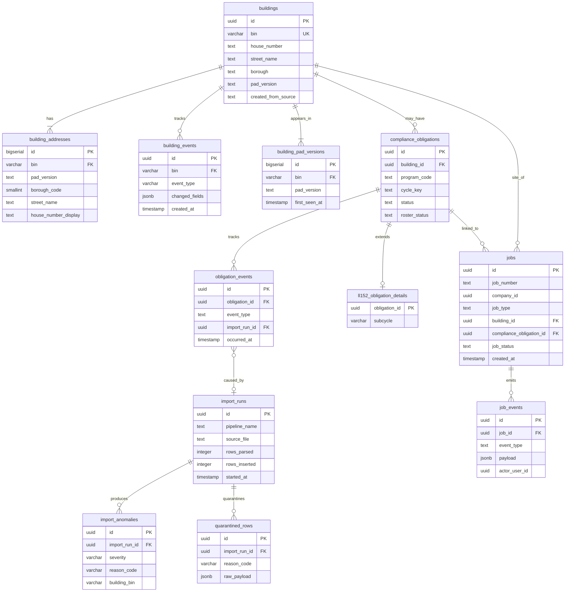

# Entity Relationship Diagram (ERD)

> **Source of Truth:** SQL queries in `crates/pcd-db/src/` (sqlx raw SQL)
> **Scope:** [Pilot Core (LL152)](file:///c:/github/pcd/docs/PILOT_SCOPE_CONTEXT.md) — Future tables shown in dashed outline.

## Entities (Implemented)

### CRM / Assets
- **buildings**: The central entity. Identity derived from BIN. Populated by PAD Bootstrap pipeline.
- **building_addresses**: PAD address entries linked to a BIN. Multiple per building per version.
- **building_events**: JSONB diff-based event log for building field changes.
- **building_pad_versions**: Junction table tracking which PAD versions contain each building (ADR-0014).

### CRM / Compliance
- **compliance_obligations**: Per-building compliance duties (program + cycle). Engine table.
- **obligation_events**: Historical changes to obligation status/roster.
- **ll152_obligation_details**: 1:1 extension table for LL152 program (subcycle A/B/C/D).

### Ingestion
- **import_runs**: Provenance tracking per pipeline execution.
- **import_anomalies**: Data quality issues detected during ingestion.
- **quarantined_rows**: Raw CSV rows that failed ingestion (ERROR severity).

### Jobs / Engine
- **jobs**: Job aggregate — lifecycle, assignment, priority, status.
- **job_events**: Domain events emitted by Job aggregate operations.

## Diagram

## Relationships Summary

| From | To | Cardinality | Description |
| :--- | :--- | :--- | :--- |
| `buildings` | `building_addresses` | 1:N | Each building has multiple PAD addresses |
| `buildings` | `building_events` | 1:N | JSONB diff events for field changes |
| `buildings` | `building_pad_versions` | 1:N | Which PAD versions contain this building |
| `buildings` | `compliance_obligations` | 1:N | Per-program compliance duties |
| `buildings` | `jobs` | 1:N | Jobs target a building |
| `compliance_obligations` | `obligation_events` | 1:N | Status change history |
| `compliance_obligations` | `ll152_obligation_details` | 1:1 | LL152-specific extension |
| `compliance_obligations` | `jobs` | 1:N | Jobs may link to an obligation |
| `import_runs` | `import_anomalies` | 1:N | Anomalies detected per run |
| `import_runs` | `quarantined_rows` | 1:N | Failed rows per run |
| `import_runs` | `obligation_events` | 1:N | Roster changes traced to import |
| `jobs` | `job_events` | 1:N | Domain events per job |
