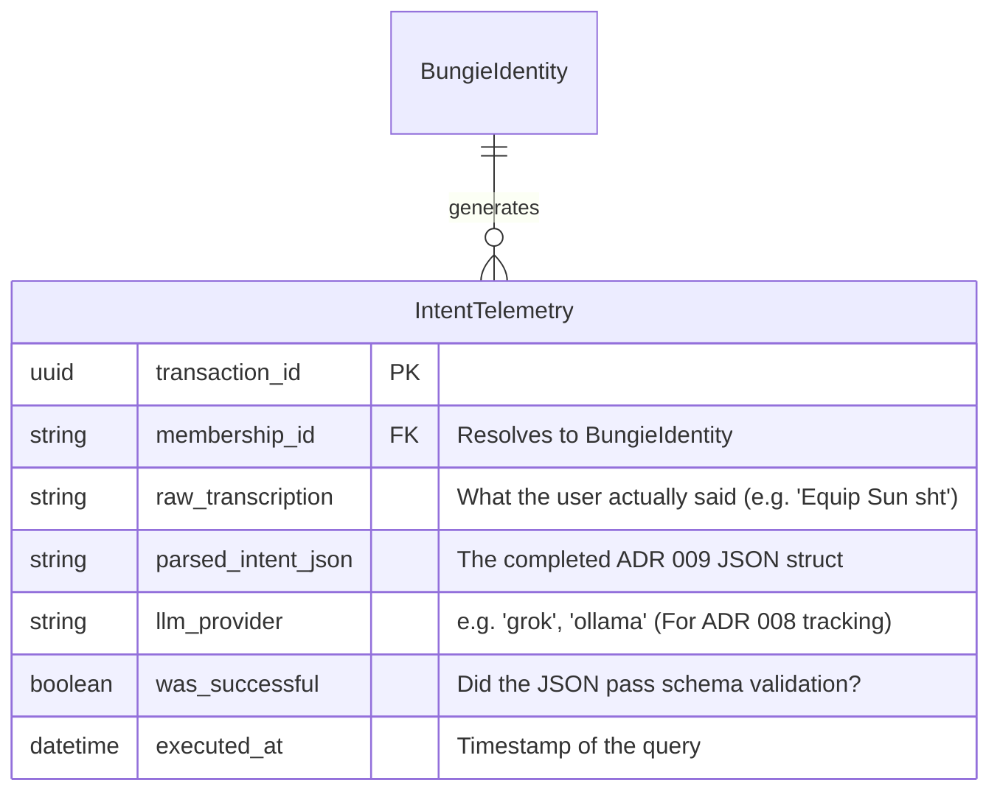

# Entity-Relationship Diagram: Voice AI Bounded Context

## Context
The primary execution loop of the Voice AI Saga (`VoiceCommandSaga`) is mathematically ephemeral; it processes an audio string, translates it to JSON, and yields it to memory.
However, to support the MLOps pipeline (originally residing in `ghost/finetune.py`), it is critical to persist interactions to train future, specialized Destiny 2 fine-tuned LLMs. 

This diagram represents the analytics and training persistence logic for `crates/db/`.

## Diagram

## Security Invariants
1. **Strict PII Deletion:** Voice transcriptions represent a heavily regulated privacy boundary. The `raw_transcription` column must be subjected to standard Data Retention Policies (e.g. wiped after 30 days unless explicitly explicitly flagged for training data via user opt-in workflows).
2. **Failover Observability:** By logging the `llm_provider` used for the request, we can build telemetry dashboards showing exactly how often the `Primary LLM` failed over to the `Secondary Offline LLM` (ADR 008 validation).
