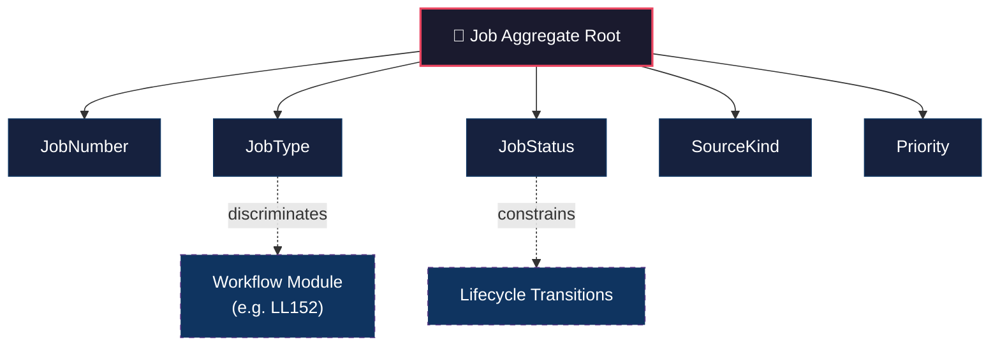

# Job Aggregate — Value Object Overview

## Aggregate → VO Relationship Map

---

## VO Cards

### 🔑 JobNumber

| Aspect | Detail |
|---|---|
| **What it is** | Human-facing job reference used by office staff and field staff |
| **Format** | Likely sequential or prefixed string (e.g. `J-00142`, `2026-0053`) |
| **Invariants** | Unique per company. Immutable once assigned. Non-nullable. |
| **Open question** | ~~Must it exist at creation, or can it be assigned later?~~ Resolved: always assigned at creation. |
| **Why it's a VO** | Has format rules, uniqueness constraints, and display behavior distinct from a raw string |

---

### 🏷️ JobType

| Aspect | Detail |
|---|---|
| **What it is** | Workflow discriminator — identifies which workflow plugin governs this job |
| **Known values** | `LL152_INSPECTION`, and future types like `REPAIR`, `ESTIMATE`, `FOLLOW_UP`, `EMERGENCY` |
| **Invariants** | Required. Immutable after creation (changing type = different job). Must map to a registered workflow. |
| **Implications** | Determines: which workflow extension applies, what form schema is used, what completeness rules exist |
| **Why it's a VO** | Not just a string — it carries behavioral meaning. The system routes to different workflow modules based on this value. |

---

### 🚦 JobStatus

| Aspect | Detail |
|---|---|
| **What it is** | The generic lifecycle state of the job |
| **Values** | `OPEN`, `IN_PROGRESS`, `COMPLETED`, `CANCELED` |
| **Invariants** | Required. Exactly one at all times. Only valid transitions allowed (see §10). Terminal states: `COMPLETED`, `CANCELED`. |
| **Transition guards** | `→ IN_PROGRESS`: explicit `StartJob` command. `→ COMPLETED`: `CompleteJob` + workflow criteria. `→ CANCELED`: `CancelJob` command. |
| **Timestamp coupling** | `IN_PROGRESS` ↔ `started_at`, `COMPLETED` ↔ `completed_at`, `CANCELED` ↔ `canceled_at` (bidirectional, write-once) |
| **Why it's a VO** | Has strict transition rules, guards, and coupled side-effects. Not a free enum — it's a state machine node. |

---

### 📋 SourceKind

| Aspect | Detail |
|---|---|
| **What it is** | Why the job exists — captures the origin/reason for creation |
| **Candidate values** | `OBLIGATION_DRIVEN`, `CUSTOMER_REQUEST`, `FOLLOW_UP`, `ESTIMATE_CONVERSION`, `OFFICE_INITIATED`, `EMERGENCY_CALL` |
| **Invariants** | Optional. Immutable after creation (the reason a job was created doesn't change). |
| **Open question** | Is this truly universal, or only strongly common? (Open Decision #5) |
| **Why it's a VO** | Enumerated value with potential reporting/filtering behavior. Could influence default priority or workflow routing. |

---

### ⚡ Priority

| Aspect | Detail |
|---|---|
| **What it is** | Generic urgency/importance indicator |
| **Candidate values** | `NORMAL`, `HIGH`, `URGENT` |
| **Invariants** | Optional (may become required). Mutable — priority can change during job lifecycle. Frozen at terminal states. |
| **Open question** | Should it be required for emergency/repair scenarios? (Open Decision #6) |
| **Policy potential** | Could carry behavior: `URGENT` might auto-notify, affect sort order, or influence deadline rules |
| **Why it's a VO** | If it stays a pure 3-value enum with no behavior, it might remain a simple field. Becomes a VO if policy logic attaches to it. |

---

## Lower-Confidence Candidates

These **might not need VO specs** unless stronger invariants emerge:

| Candidate | Current Assessment |
|---|---|
| **SiteNotes** | Freeform text, no format rules, no validation. Likely stays a plain string. |
| **JobTitle** | Auto-generated string with optional override. Could become a VO if generation logic is complex. |
| **JobSummary** | Optional freeform text. No invariants beyond workflow-agnosticism. Likely stays a plain string. |

---

## Spec Priority

| Order | VO | Rationale |
|---|---|---|
| 1 | **JobStatus** | Most behavioral complexity — state machine with guards and transitions |
| 2 | **JobNumber** | Has open design decisions (timing, format, uniqueness scope) |
| 3 | **SourceKind** | Simpler enum, but has open universality question |
| 4 | **Priority** | May not need a spec if it stays a simple enum |
| 5 | **JobType** | Most architectural impact — saved for last because it drives the engine/workflow seam and benefits from having the others defined first |
