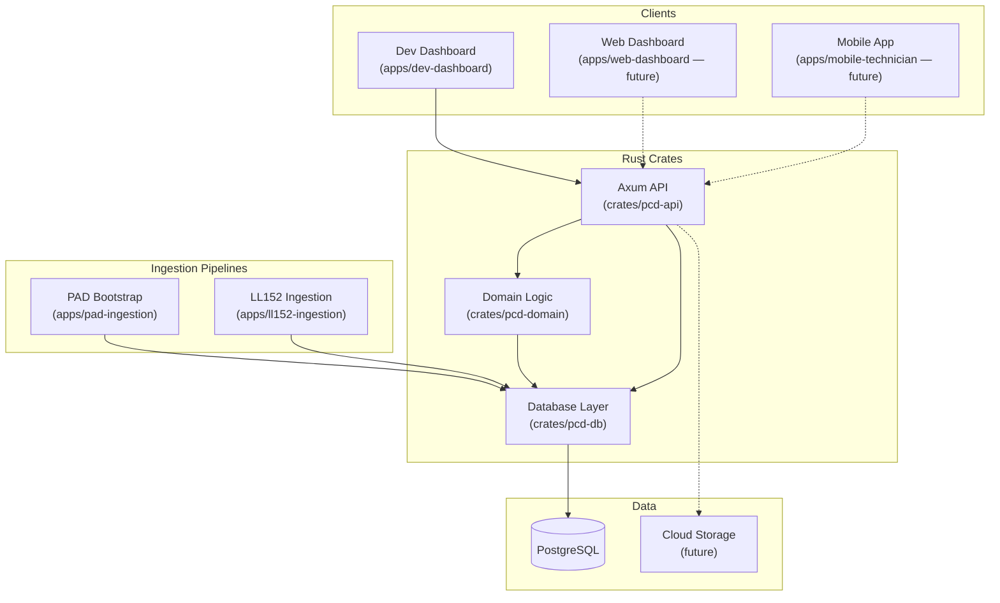

# High-Level Diagram

## Overview
This document fulfills the first component of the System Architecture: a general description of the system architecture represented diagrammatically. It illustrates the high-level containers and their relationships, while mapping the DDD Modules to these structural components.

## Diagram



> **Note:** Dashed lines (-.->)  indicate planned/future connections.

## Component / Module Summary

| Component | Location | Responsibility |
|-----------|----------|----------------|
| **Dev Dashboard** | `apps/dev-dashboard` | Next.js admin interface for exploring buildings, obligations, import runs, and anomalies. Connects to the Rust API. |
| **Axum API** | `crates/pcd-api` | HTTP routing and request handling. Thin shell — delegates to domain and DB crates. |
| **Domain Logic** | `crates/pcd-domain` | Pure business logic: aggregates, value objects, domain events, repository traits. No framework or DB dependencies. |
| **Database Layer** | `crates/pcd-db` | sqlx-based PostgreSQL queries. Implements repository traits. Contains CRM dashboard queries and Jobs persistence. |
| **PAD Bootstrap** | `apps/pad-ingestion` | Ingestion pipeline for NYC PAD (Property Address Directory) data. Writes directly to PostgreSQL. |
| **LL152 Ingestion** | `apps/ll152-ingestion` | Ingestion pipeline for DOB LL152 compliance data. Writes directly to PostgreSQL. |

## Domain Modules

| Module | Domain Crate | DB Crate | API Routes | Status |
|--------|-------------|----------|------------|--------|
| **CRM / Assets** | `pcd-domain/src/crm/` | `pcd-db/src/crm/` | `pcd-api/src/routes/crm.rs` | ✅ Implemented |
| **Jobs / Engine** | `pcd-domain/src/jobs/` | `pcd-db/src/jobs/` | `pcd-api/src/routes/jobs.rs` | ✅ Implemented |
| **Auth** | — | — | — | ⏳ Future |
| **CRM / Clients** | — | — | — | ⏳ Future |
| **CRM / Operations** | — | — | — | ⏳ Future |

## Key Flows
1. **Building Exploration:** User searches in Dashboard → API routes to `pcd-db/crm` → returns building profile with addresses, obligations, timeline, lineage.
2. **PAD Ingestion:** PAD Bootstrap pipeline parses CSV → inserts/updates buildings + addresses + events in PostgreSQL → triggers supersession detection.
3. **Job Lifecycle:** API receives job creation request → `pcd-domain/jobs` validates and emits events → `pcd-db/jobs` persists via transactional upsert.

## Monorepo Structure

```
pcd/
├── apps/              → Deployable units
│   ├── dev-dashboard/ → Next.js development dashboard
│   ├── pad-ingestion/ → PAD data ingestion pipeline
│   └── ll152-ingestion/ → LL152 compliance ingestion
├── crates/            → Rust crates (core system)
│   ├── pcd-api/       → Axum HTTP server + routes
│   ├── pcd-domain/    → Pure domain logic (aggregates, VOs, events)
│   └── pcd-db/        → sqlx database queries + repository impls
├── docs/              → Documentation (DDD, ADRs, etc.)
└── .archive/          → Pre-Rust TS code (reference only)
```

## Assumptions and Constraints
- **Rust Backend:** Core business logic and API are implemented in Rust for type safety and performance.
- **Crate-Based Separation:** `pcd-domain` has zero infrastructure dependencies. `pcd-db` implements persistence. `pcd-api` handles HTTP.
- **Centralized Database:** PostgreSQL is the single data store. All crates share the same database via connection pool.
- **Next.js Dashboard:** The dev dashboard is a separate Next.js app that communicates with the Rust API over HTTP.
