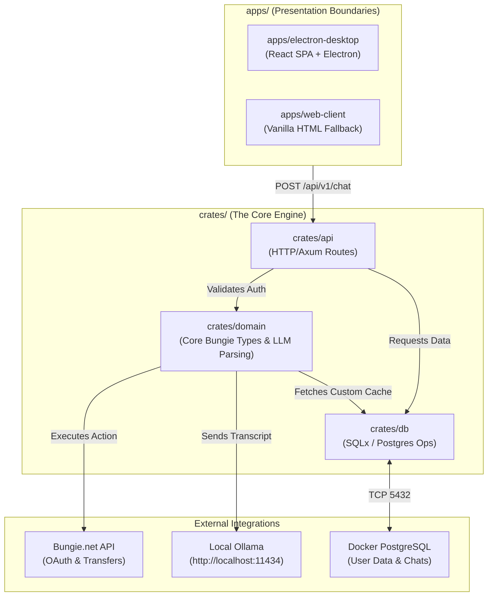

# Detailed Design: High Level Diagram (SystemArchitecture)

This diagram outlines the macro flow of intents through the Cargo Workspace isolation barriers.

```mermaid
flowchart TD
    subgraph Apps["apps/ (Presentation Boundaries)"]
        direction LR
        UI_Electron["apps/electron-desktop\n(React SPA + Electron)"]
        UI_Web["apps/web-client\n(Vanilla HTML Fallback)"]
    end

    subgraph Crates["crates/ (The Core Engine)"]
        direction TB
        AxumAPI["crates/api\n(HTTP/Axum Routes)"]
        Domain["crates/domain\n(Core Bungie Types & LLM Parsing)"]
        DB["crates/db\n(SQLx / Postgres Ops)"]

        AxumAPI --> |"Validates Auth"| Domain
        AxumAPI --> |"Requests Data"| DB
        Domain --> |"Fetches Custom Cache"| DB
    end

    subgraph External["External Integrations"]
        Bungie["Bungie.net API\n(OAuth & Transfers)"]
        Ollama["Local Ollama\n(http://localhost:11434)"]
        PG["Docker PostgreSQL\n(User Data & Chats)"]
    end

    Apps -->|"POST /api/v1/chat"| AxumAPI
    Domain -->|"Executes Action"| Bungie
    Domain -->|"Sends Transcript"| Ollama
    DB <-->|"TCP 5432"| PG
```
