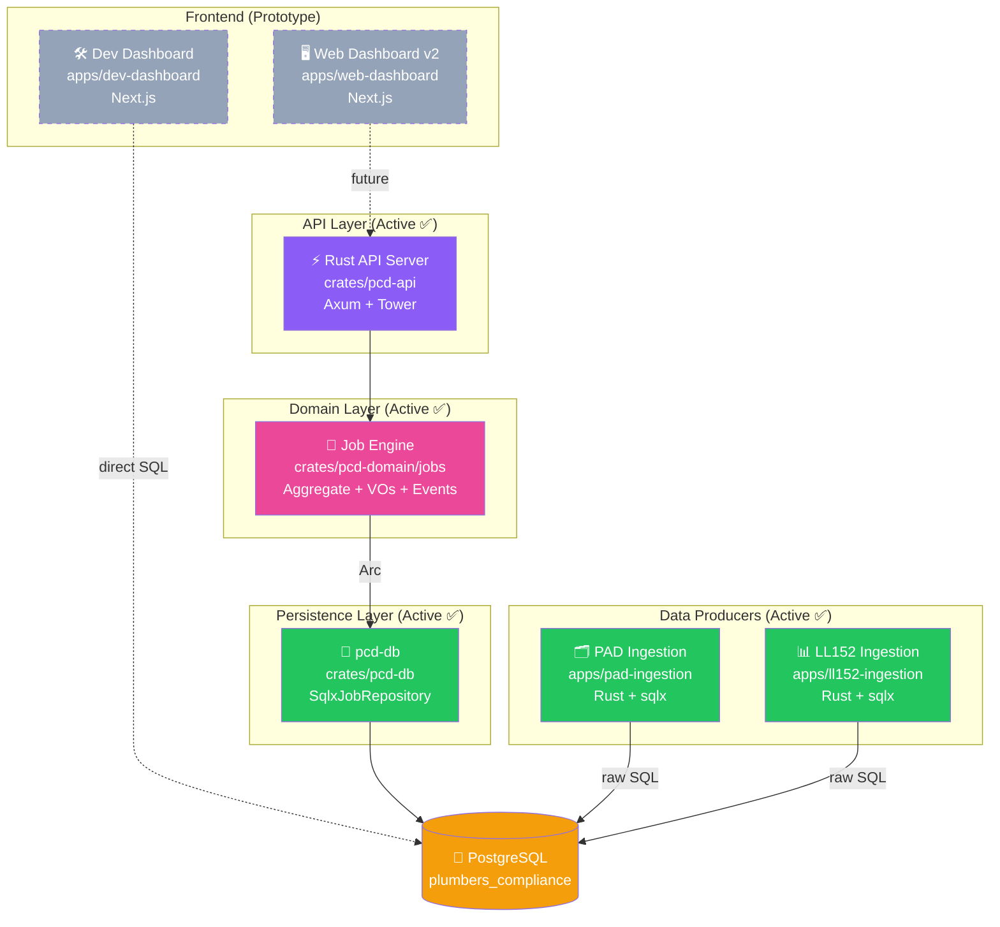
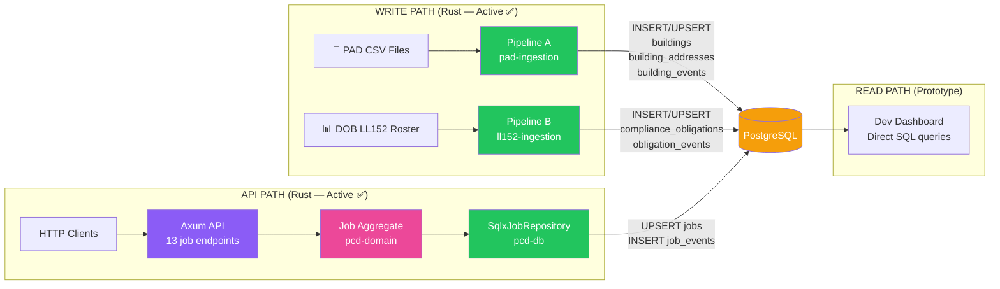
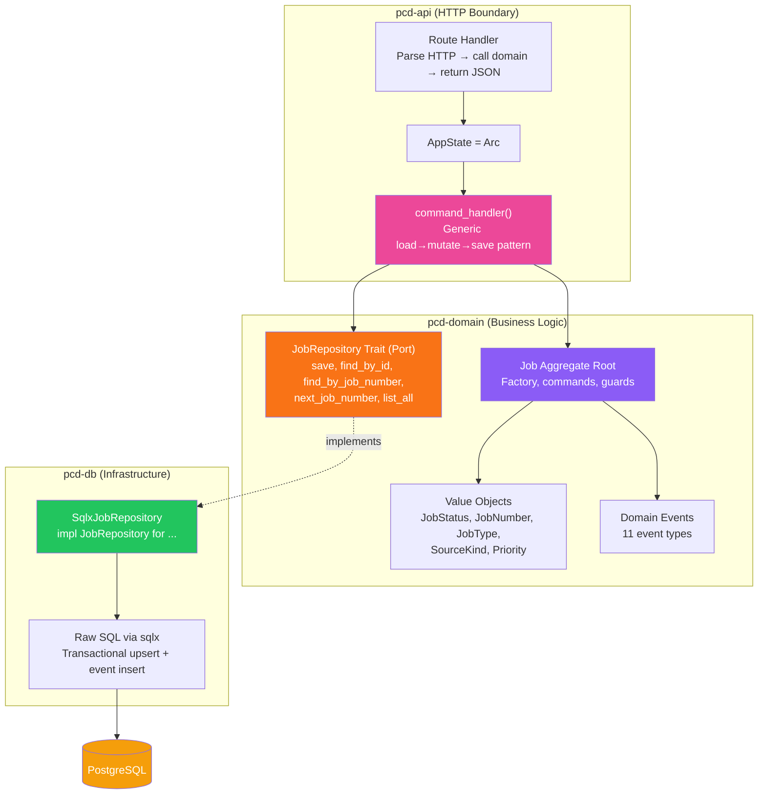
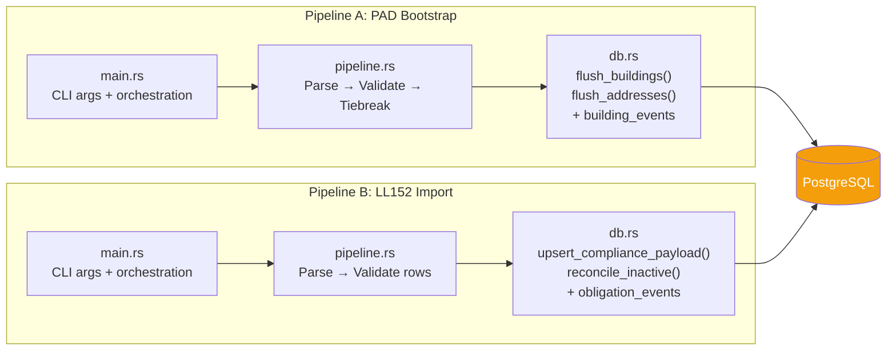

# PCD System Architecture Overview

> **Last Updated:** March 2026
> **Status:** Living document reflecting the current architecture

---

## System-Level View

> 🟣 API | 🩷 Domain | 🟢 Adapters/Producers | 🟡 Database | ⬜ Prototype

---

## Data Flow: Write Path vs Read Path

---

## Schema Management

Database tables are created and managed via **raw SQL migrations** committed in the repository. There is no external schema tool (Drizzle was previously used but has been removed). The Rust crates write raw SQL against the tables directly.

> ⚠️ **Schema changes require manual coordination.** If you add or rename a column, you must update the raw SQL in every Rust file that references it.

---

## Hexagonal Architecture (Rust Crates)

| Layer | Can Import | Cannot Import |
| :--- | :--- | :--- |
| **Domain** (pcd-domain) | Nothing (pure) | pcd-db, pcd-api |
| **Application** (pcd-api) | pcd-domain | pcd-db (only via trait) |
| **Infrastructure** (pcd-db) | pcd-domain (for trait + types) | pcd-api |

---

## Pipeline Architecture (Rust — Flat)

> Rust pipelines are **flat**: `main → pipeline → db`. No hexagonal layers needed — they're batch CLI tools, not long-running services.

---

## Technology Summary

| Component | Technology | Role |
| :--- | :--- | :--- |
| `pcd-domain` | Rust | Domain layer — aggregates, VOs, events, repository traits |
| `pcd-db` | Rust + sqlx | Infrastructure — repository adapters |
| `pcd-api` | Rust + Axum | HTTP API server |
| `pad-ingestion` | Rust + sqlx | Pipeline A — building bootstrap |
| `ll152-ingestion` | Rust + sqlx | Pipeline B — compliance obligations |
| `web-dashboard` | TypeScript + Next.js | Prototype UI |
| `dev-dashboard` | TypeScript + Next.js | Developer tools UI |
| PostgreSQL | — | Single database for all data |
