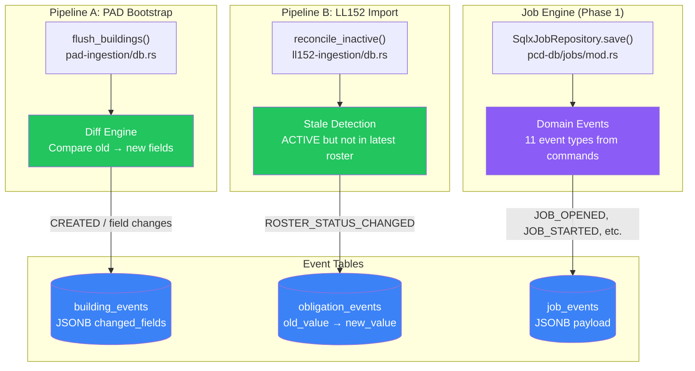

# Event History — Architecture

The event history system is a **cross-cutting concern** — not a standalone module. It provides an append-only audit trail of changes made to domain entities during data ingestion. Two separate producers write to two separate event tables, each with distinct schemas optimized for their domain.

## System-Level Flow

## Three Event Systems Compared

| Aspect | Building Events | Obligation Events | Job Events |
| :--- | :--- | :--- | :--- |
| **Table** | `building_events` | `obligation_events` | `job_events` |
| **Producer** | PAD ingestion (`flush_buildings`) | LL152 ingestion (`reconcile_inactive`) | Job aggregate commands |
| **Trigger** | Data import diff | Roster reconciliation | User actions via API |
| **Schema** | JSONB `changed_fields` (structured diff) | Flat `old_value → new_value` | JSONB `payload` (event-specific) |
| **Event types** | `PAD_UPDATE_{version}` | `ROSTER_STATUS_CHANGED` | 11 types (JOB_OPENED, etc.) |
| **FK** | `bin` (varchar) | `obligation_id` (uuid) | `job_id` (uuid) |
| **Actor** | System (import pipeline) | System (import pipeline) | User (`actor_user_id`) |
| **Traceability** | Via `event_type` (PAD version) | Via `import_run_id` | Via `actor_user_id` |

## Design Principles

1. **Append-only** — Events are inserted, never updated or deleted
2. **Domain separation** — Each aggregate has its own event table with a schema optimized for its use case
3. **Co-transactional** — Events are written in the same transaction as their parent entity mutation
4. **Immutable records** — Once written, event data is permanent audit evidence

## Known Gaps

| Gap | Affected Table | Status |
| :--- | :--- | :--- |
| Field-level change tracking during obligation upsert | `obligation_events` | Not yet implemented |
| INACTIVE → ACTIVE reactivation events | `obligation_events` | Not yet implemented |
| Obligation creation events | `obligation_events` | Not yet implemented |

> [!TIP]
> The obligation event gaps can be resolved by adapting PAD's `flush_buildings()` diff pattern: fetch existing records before upserting, compare fields, and insert events for changes.
