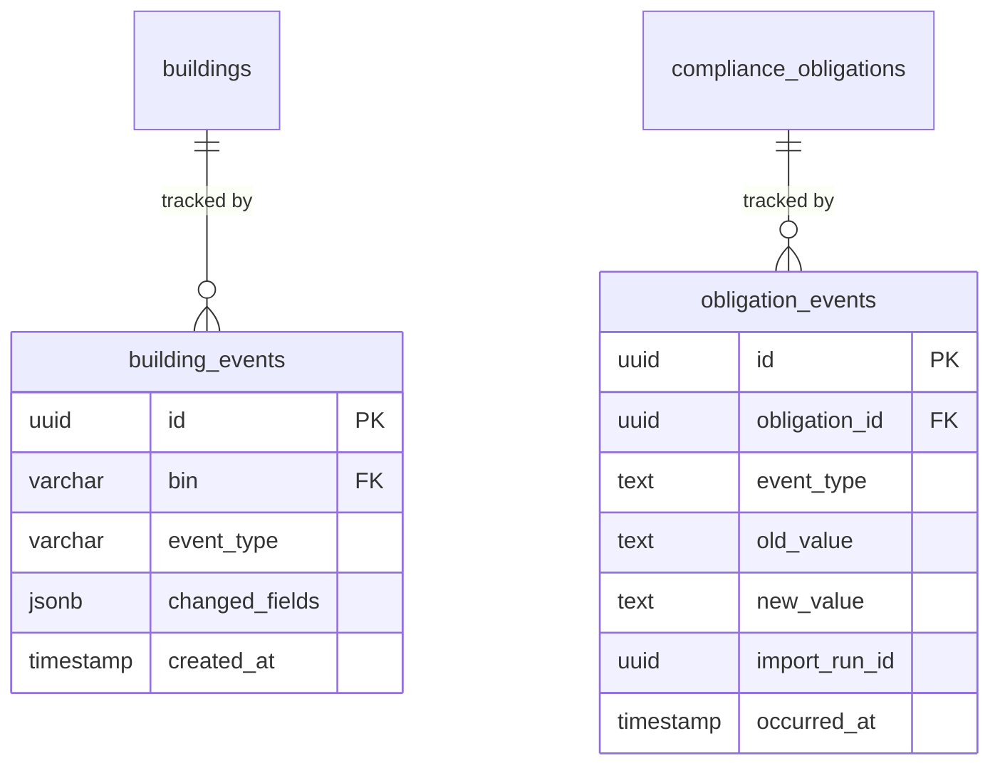

# Event History System

## Overview
The event history system provides an **append-only audit trail** of changes made to core domain entities during data ingestion. It enables traceability, debugging, and future replay/diff capabilities.

## Schema

Two event tables serve two distinct domain aggregates:

## Design Patterns

| Pattern | Detail |
| :--- | :--- |
| **Append-only** | Events are inserted, never updated or deleted |
| **Domain separation** | Building identity and compliance status are tracked independently |
| **Run traceability** | Every event can be traced to the import run or PAD version that caused it |
| **Structured diffs** | `building_events` stores field-level diffs as JSONB |
| **Simple transitions** | `obligation_events` stores flat `old_value → new_value` state changes |

## Documentation

### Architecture
- [Architecture](Architecture.md) — System-level flow, comparison of all 3 event systems, known gaps

### Feature Slices

Each slice documents a specific producer of event history:

| Slice | Producer | Target Table |
| :--- | :--- | :--- |
| [Building Events](building-events.md) | PAD Ingestion (Pipeline A) | `building_events` |
| [Obligation Events](obligation-events.md) | LL152 Ingestion (Pipeline B) | `obligation_events` |

### Reference
- [Query Guide](queries.md) — Practical SQL queries for debugging, auditing, and analytics

## Current Gaps

> [!NOTE]
> The LL152 `upsert_compliance_payload()` function does **not** currently generate events when obligation fields (like `window_start`, `window_end`) change during re-import. Only the reconciliation step (ACTIVE → INACTIVE) produces events. Field-level change tracking for obligations would mirror the pattern used by PAD's `flush_buildings()`.
