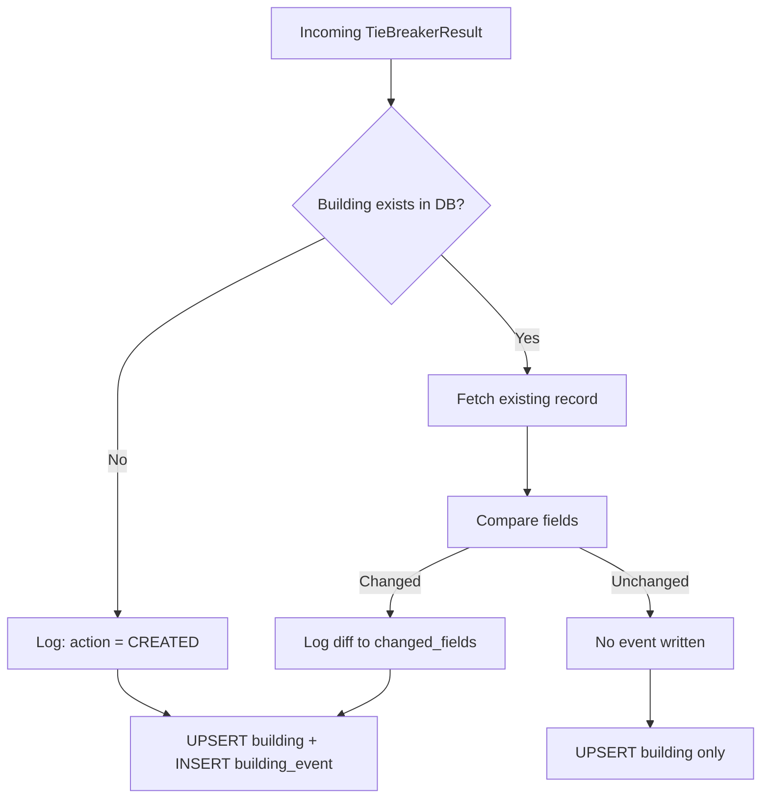

# Feature Slice: Building Events

> **Producer:** `apps/pad-ingestion/src/db.rs` — [`flush_buildings()`](file:///c:/github/pcd/apps/pad-ingestion/src/db.rs)
> **Target Table:** `building_events`
> **Trigger:** Every PAD Bootstrap ingestion run (Pipeline A)

## How It Works

During `flush_buildings()`, every chunk of buildings goes through a **diff-before-write** cycle:



## Event Schema

```sql
INSERT INTO building_events (bin, event_type, changed_fields)
```

| Column | Type | Description |
| :--- | :--- | :--- |
| `id` | uuid (auto) | Unique event ID |
| `bin` | varchar FK | The building this event belongs to |
| `event_type` | varchar | Format: `PAD_UPDATE_{version}` (e.g., `PAD_UPDATE_25A`) |
| `changed_fields` | jsonb | Structured diff of what changed |
| `created_at` | timestamp | When the event was recorded |

## Tracked Fields

The diff engine compares three field groups:

### 1. Primary BBL
```json
{
  "primary_bbl": {
    "old": "1-10-50",
    "new": "1-10-51"
  }
}
```
Fires when any of `primary_bbl_borough_code`, `primary_bbl_block`, or `primary_bbl_lot` changes. The triple is formatted as a human-readable `"boro-block-lot"` string.

### 2. Condo Flag
```json
{
  "pad_condo_flag": {
    "old": null,
    "new": "C"
  }
}
```
Fires when `pad_condo_flag` changes (e.g., building becomes a condo).

### 3. Billing BBL
```json
{
  "pad_billing_bbl": {
    "old": "null",
    "new": "1-10-7501"
  }
}
```
Fires when any of `pad_billing_bbl_borough`, `pad_billing_bbl_block`, or `pad_billing_bbl_lot` changes.

### 4. New Building
```json
{
  "action": "CREATED"
}
```
Written when a BIN has no existing record in the database.

## When Events Are NOT Written

- If a building already exists and **no tracked fields changed**, no event is written (the UPSERT still updates `pad_last_seen_at` and provenance fields silently).
- Fields like `pad_low_bbl_lot`, `pad_high_bbl_lot`, and `pad_version` are updated on every run but are **not** tracked in events.

## Transaction Scope

Building events are written in the **same transaction** as their parent building UPSERT, ensuring atomicity: if the upsert fails, the event is not orphaned.

## Source Code Reference

| Code Location | Line Range | What It Does |
| :--- | :--- | :--- |
| [flush_buildings()](file:///c:/github/pcd/apps/pad-ingestion/src/db.rs#L44-L224) | 44–224 | Full function |
| [Change detection](file:///c:/github/pcd/apps/pad-ingestion/src/db.rs#L107-L137) | 107–137 | Diff comparison logic |
| [Event batch insert](file:///c:/github/pcd/apps/pad-ingestion/src/db.rs#L206-L218) | 206–218 | QueryBuilder for events |
