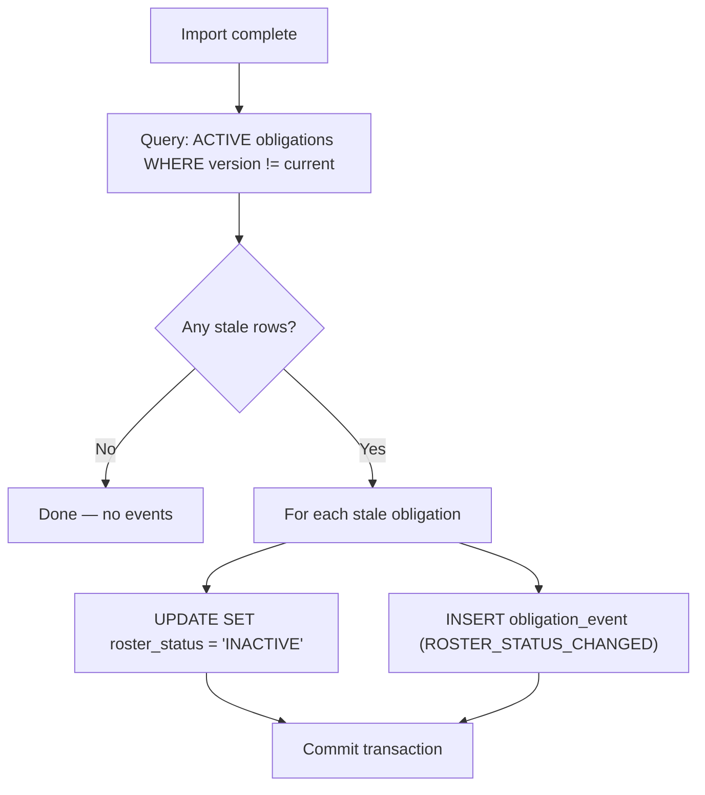

# Feature Slice: Obligation Events

> **Producer:** `apps/ll152-ingestion/src/db.rs` — [`reconcile_inactive_obligations()`](file:///c:/github/pcd/apps/ll152-ingestion/src/db.rs)
> **Target Table:** `obligation_events`
> **Trigger:** Post-import reconciliation phase of every LL152 roster ingestion (Pipeline B)

## How It Works

After all valid rows have been upserted, `reconcile_inactive_obligations()` identifies **stale obligations** — those marked `ACTIVE` but not touched by the current import — and transitions them to `INACTIVE`:



## Event Schema

```sql
INSERT INTO obligation_events
  (id, obligation_id, event_type, old_value, new_value, import_run_id, occurred_at)
VALUES ($1, $2, 'ROSTER_STATUS_CHANGED', 'ACTIVE', 'INACTIVE', $3, $4)
```

| Column | Type | Description |
| :--- | :--- | :--- |
| `id` | uuid | Unique event ID |
| `obligation_id` | uuid FK | The compliance obligation this event belongs to |
| `event_type` | text | Always `ROSTER_STATUS_CHANGED` (currently the only type) |
| `old_value` | text | Previous state: `ACTIVE` |
| `new_value` | text | New state: `INACTIVE` |
| `import_run_id` | uuid | Links to the specific `import_runs` row that triggered the change |
| `occurred_at` | timestamp | When the status change was recorded |

## Stale Detection Logic

A compliance obligation is considered **stale** if:

```sql
WHERE program_code = $1            -- same program (LL152)
  AND roster_status = 'ACTIVE'     -- currently active
  AND (last_imported_from_version IS NULL
       OR last_imported_from_version != $2)  -- NOT touched by current roster version
```

This means: if a building was on last cycle's roster but is **absent from the new one**, its obligation is deactivated.

## What IS and IS NOT Tracked

### ✅ Currently Tracked
| Event | When |
| :--- | :--- |
| `ROSTER_STATUS_CHANGED` (ACTIVE → INACTIVE) | Obligation removed from latest DOB roster |

### ❌ Not Yet Tracked
| Scenario | Notes |
| :--- | :--- |
| Obligation field updates (window dates, etc.) | `upsert_compliance_payload()` updates fields silently via `ON CONFLICT ... DO UPDATE` |
| INACTIVE → ACTIVE reactivation | If a building reappears on a roster, the upsert silently updates — no event logged |
| Obligation creation | New obligations are inserted without a corresponding event |

> [!TIP]
> To add field-level change tracking, the pattern from `pad-ingestion`'s `flush_buildings()` can be adapted: fetch existing records before upserting, diff the fields, and insert `obligation_events` rows for any changes.

## Transaction Scope

Reconciliation runs in its **own transaction**, separate from the main upsert batch. Both the `UPDATE` and `INSERT INTO obligation_events` are committed together, so an event is never orphaned.

## Source Code Reference

| Code Location | Line Range | What It Does |
| :--- | :--- | :--- |
| [reconcile_inactive_obligations()](file:///c:/github/pcd/apps/ll152-ingestion/src/db.rs#L201-L264) | 201–264 | Full function |
| [Stale query](file:///c:/github/pcd/apps/ll152-ingestion/src/db.rs#L208-L222) | 208–222 | Detection SQL |
| [Event insert](file:///c:/github/pcd/apps/ll152-ingestion/src/db.rs#L248-L259) | 248–259 | Event row insert |
