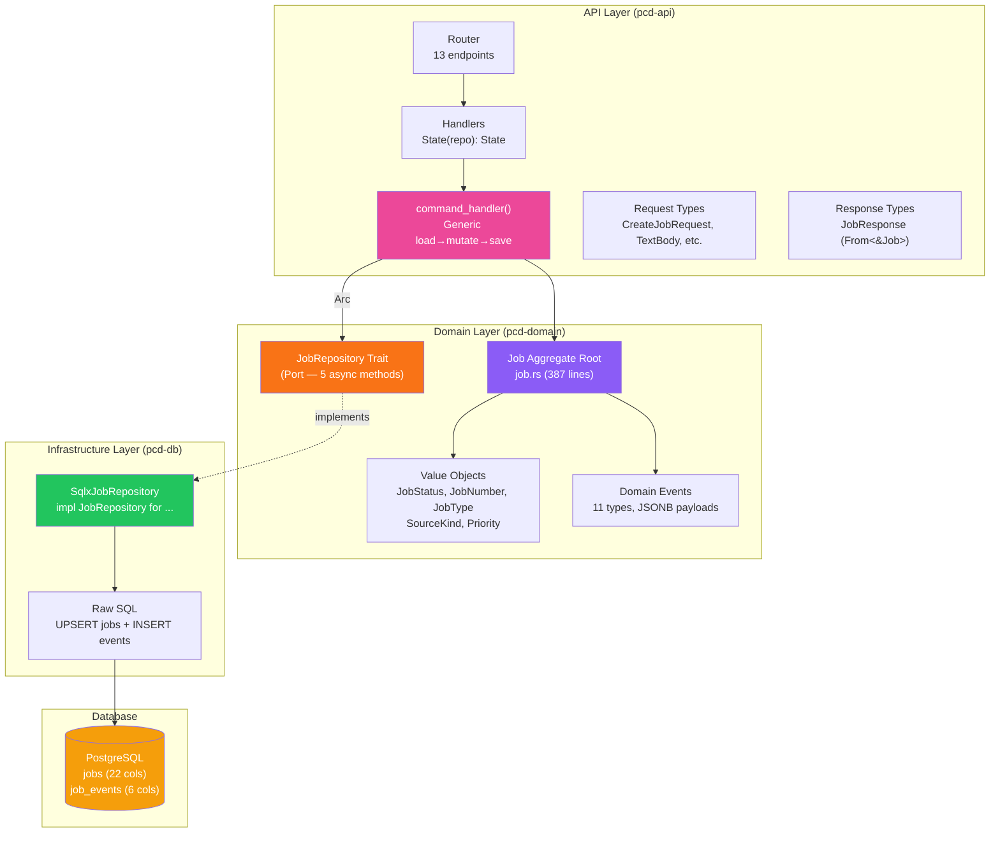
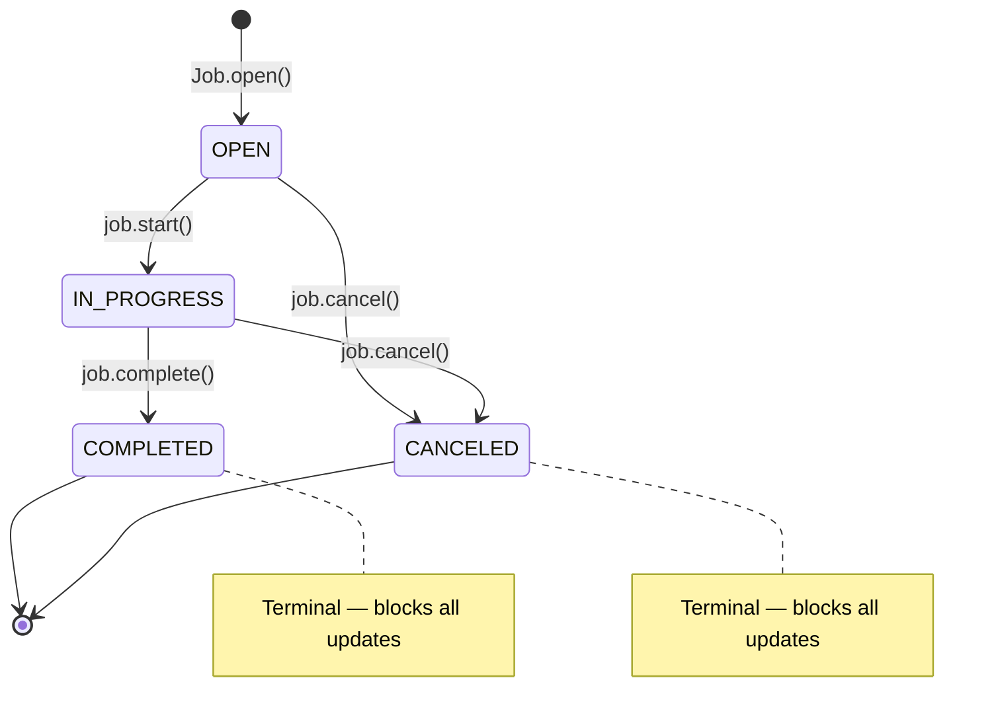
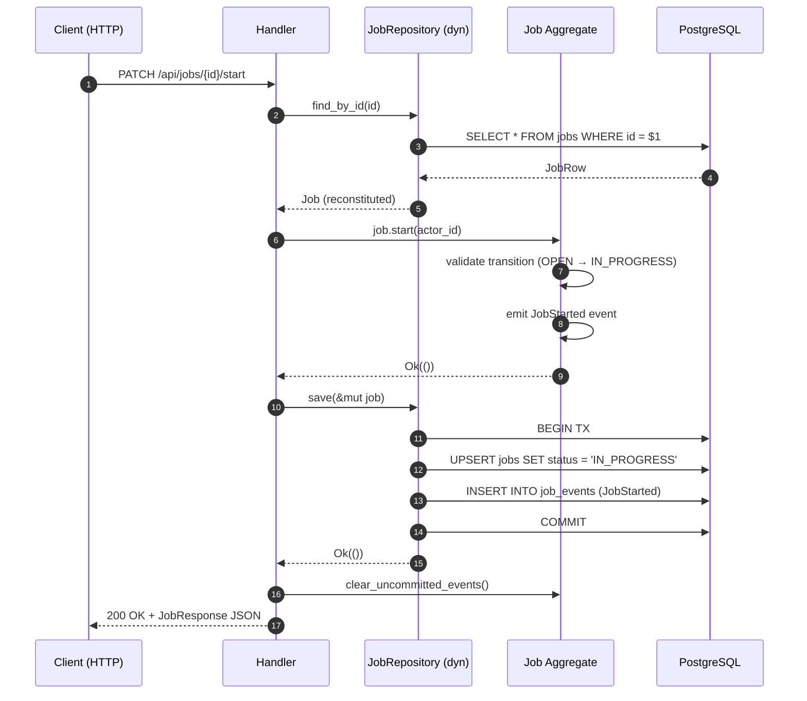

# Job Engine Architecture

The Job Engine spans three Rust crates following hexagonal architecture. The domain layer owns the business rules, the database adapter implements persistence, and the API layer exposes HTTP endpoints — all connected through a trait-based port.

## Hexagonal Layer Diagram

> 🟣 Domain | 🟠 Port | 🟢 Adapter | 🟡 Database | 🩷 Pattern

## State Machine

- 4 states, 2 terminal (`COMPLETED`, `CANCELED`)
- Terminal states block all update commands via `guard_not_terminal()`
- No backward transitions from terminal states

## Command Flow (Sequence)

## Module Responsibilities

| Module | Crate | Responsibility |
| :--- | :--- | :--- |
| **job.rs** | pcd-domain | Aggregate root: factory, 8 commands, terminal guard, event emission, reconstitution |
| **job_status.rs** | pcd-domain | State machine: 4 states, valid transitions, `is_terminal()`, `transition_to()` |
| **job_number.rs** | pcd-domain | VO: non-empty, max 20 chars, uppercase normalization |
| **job_type.rs** | pcd-domain | VO: extensible enum with `LL152_INSPECTION` as first type |
| **source_kind.rs** | pcd-domain | VO: 6 intake source categories |
| **priority.rs** | pcd-domain | VO: 3-value enum (NORMAL, HIGH, URGENT) with ordinal ranking |
| **events.rs** | pcd-domain | 11 domain event types + typed `JobOpenedPayload` struct |
| **repository.rs** | pcd-domain | Port: `JobRepository` trait (5 async methods) |
| **tests.rs** | pcd-domain | 47 unit tests across 7 modules |
| **mod.rs** | pcd-db | Adapter: `SqlxJobRepository` implementing `JobRepository` |
| **routes/jobs.rs** | pcd-api | 13 HTTP handlers + `command_handler` generic pattern |
