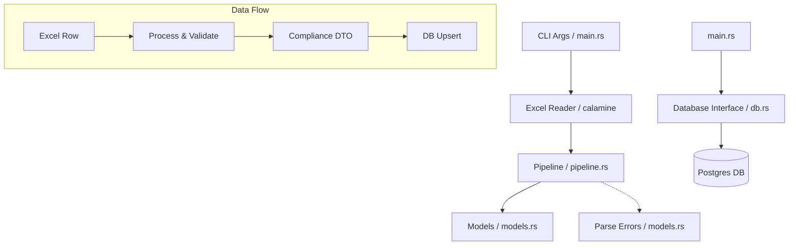
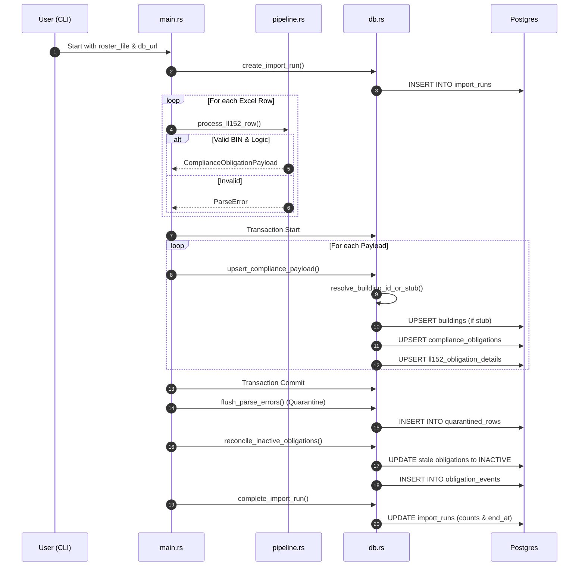

# ll152-ingestion Architecture

The `ll152-ingestion` app is a Rust-based CLI worker responsible for ingesting DOB LL152 rosters (Excel format) and managing Compliance Obligations in the database.

## System Components

## Ingestion Sequence Flow

This diagram illustrates the step-by-step processing of a roster.

## Module Responsibilities

| Module | Responsibility |
| :--- | :--- |
| **main** | Orchestrates the ETL workflow: CLI parsing, file opening, transaction management, and workflow sequencing. |
| **pipeline** | Domain logic for transformation. Validates BINs, extracts subcycles, and calculates cycle windows per DOB rules. |
| **db** | All SQL interactions. Handles complex logic like "Stub Building" creation and "Pipeline B" reconciliation. |
| **models** | Strong typing for the domain. Includes the `Bin` Value Object with its own validation logic. |
