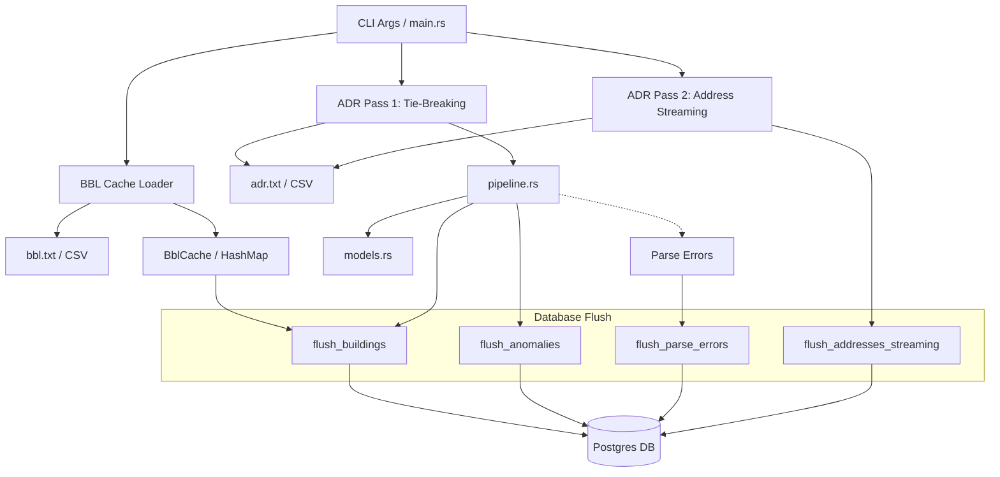
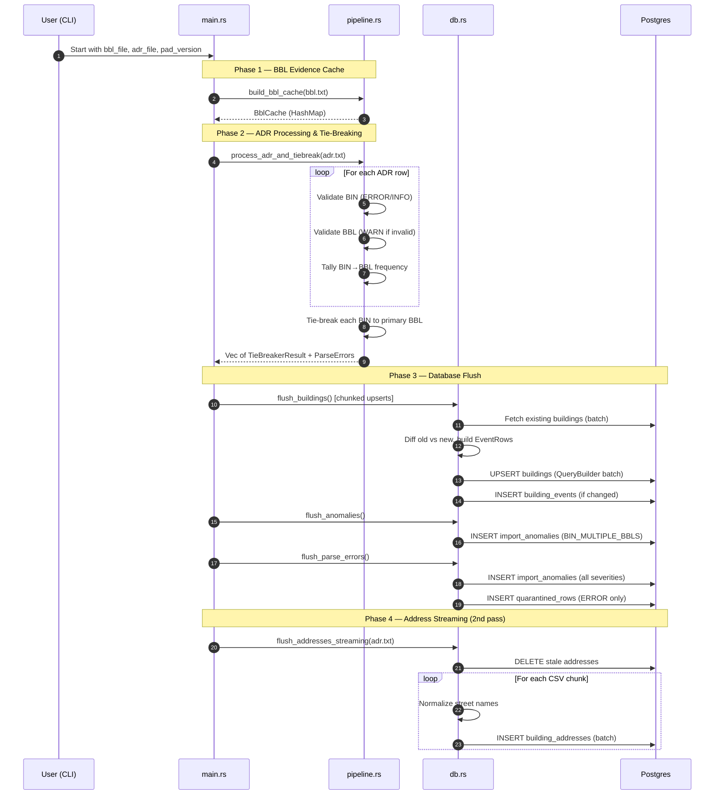

# PAD Ingestion Architecture

The `pad-ingestion` app is a Rust-based CLI worker responsible for bootstrapping the building identity layer from NYC's Property Address Directory (PAD). This is **Pipeline A** — the foundational data source that all other pipelines build upon.

## System Components

## Ingestion Sequence Flow

## Module Responsibilities

| Module | Responsibility |
| :--- | :--- |
| **main** | Orchestrates the multi-phase pipeline: CLI parsing, BBL cache load, tie-breaking, and four sequential DB flush operations. |
| **pipeline** | Pure domain logic: builds the BBL evidence cache, validates BINs/BBLs with three severity tiers, tallies BIN→BBL frequencies, and applies tie-breaking. |
| **db** | Batched database operations using `QueryBuilder`. Handles change detection, event logging, anomaly/quarantine writes, and streaming address inserts. |
| **models** | Strong typing: `Bin` VO (hard + soft validation), `Bbl` VO (10-digit canonical form), and CSV deserialization structs for `adr.txt` and `bbl.txt`. |
