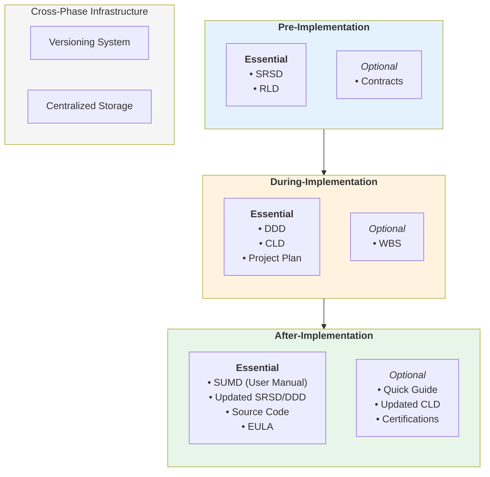
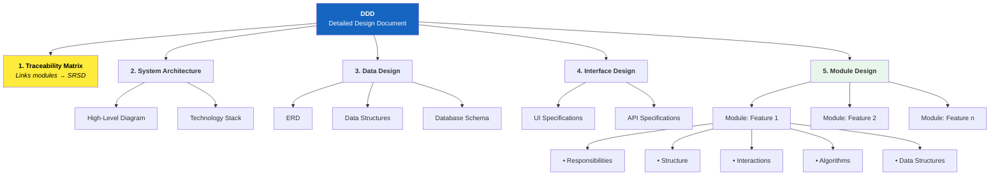
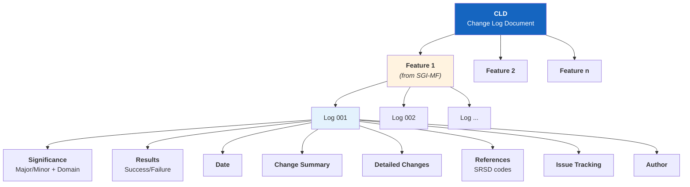
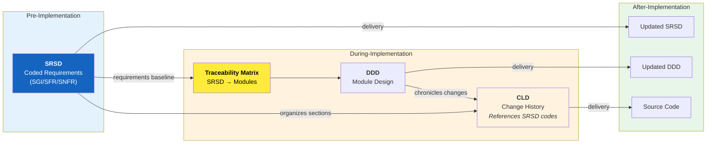
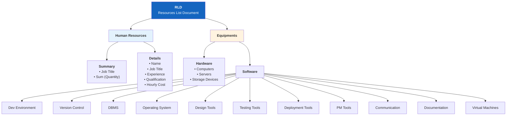
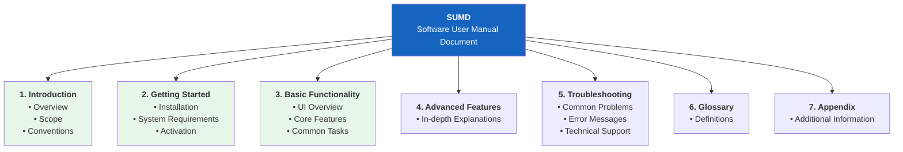
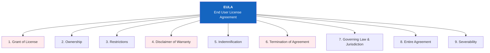

# PDA-SDD Diagrams

Visual representations of the PDA-SDD model and its document structures.

---

## Figure 1: PDA-SDD Model

*Three phases with essential/optional outputs, backed by versioning and centralized storage.*

---

## Figure 2: SRSD Coding System

*Hierarchical requirement codes for traceability.*

```mermaid
flowchart TD
    SRSD["<b>SRSD</b>"]
    
    SRSD --> SGI["<b>SGI</b><br/>General Info"]
    SRSD --> SFR["<b>SFR</b><br/>Functional"]
    SRSD --> SNFR["<b>SNFR</b><br/>Non-Functional"]

    SGI --> SGI_S["SGI-S<br/>Scope"]
    SGI --> SGI_OJ["SGI-OJ<br/>Objectives"]
    SGI --> SGI_MF["SGI-MF<br/>Main Functions"]

    SFR --> IO["SFR-IO<br/>Input/Output"]
    SFR --> PR["SFR-PR<br/>Processing"]
    SFR --> BR["SFR-BR<br/>Business Rules"]
    SFR --> SR["SFR-SR<br/>Security"]
    SFR --> IR["SFR-IR<br/>Integration"]

    IO --> IODE["IODE<br/>Data Entry"]
    IO --> IODO["IODO<br/>Data Output"]
    IO --> IOR["IOR<br/>Reporting"]

    PR --> PRC["PRC<br/>Calculation"]
    PR --> PRDM["PRDM<br/>Decision"]
    PR --> PRDP["PRDP<br/>Manipulation"]

    BR --> BRC["BRC<br/>Constraints"]
    BR --> BRV["BRV<br/>Validation"]
    BR --> BRW["BRW<br/>Workflow"]

    SR --> SRAN["SRAN<br/>Authentication"]
    SR --> SRAZ["SRAZ<br/>Authorization"]
    SR --> SRAC["SRAC<br/>Access Control"]

    IR --> IRI["IRI<br/>Interface"]
    IR --> IRDX["IRDX<br/>Data Exchange"]
    IR --> IRIN["IRIN<br/>Interoperability"]

    SNFR --> P["SNFR-P<br/>Performance"]
    SNFR --> U["SNFR-U<br/>Usability"]
    SNFR --> S["SNFR-S<br/>Security"]
    SNFR --> R["SNFR-R<br/>Reliability"]
    SNFR --> M["SNFR-M<br/>Maintainability"]

    P --> PRT["PRT<br/>Response"]
    P --> PT["PT<br/>Throughput"]
    P --> PS["PS<br/>Scalability"]

    U --> UEU["UEU<br/>Ease of Use"]
    U --> UE["UE<br/>Efficiency"]
    U --> UA["UA<br/>Aesthetics"]

    S --> SC["SC<br/>Confidentiality"]
    S --> SI["SI<br/>Integrity"]
    S --> SA["SA<br/>Availability"]

    R --> RAV["RAV<br/>Availability"]
    R --> RAC["RAC<br/>Accuracy"]
    R --> RR["RR<br/>Robustness"]

    M --> MM["MM<br/>Modifiability"]
    M --> MT["MT<br/>Testability"]
    M --> MP["MP<br/>Portability"]

    style SRSD fill:#1565c0,color:#fff
    style SGI fill:#42a5f5
    style SFR fill:#66bb6a
    style SNFR fill:#ffa726
```

---

## Figure 3: DDD Structure

*Design document anchored by traceability to SRSD.*

---

## Figure 4: CLD Structure

*Change log organized by SRSD main functions (SGI-MF).*

---

## Figure 5: Traceability Spine

*How documents connect across the lifecycle.*

---

## Figure 6: RLD Structure

*Pre-stage resource grounding: Humans + Equipment.*

---

## Figure 7: SUMD Structure

*User manual with 8-section structure for onboarding → usage → support.*

---

## Figure 8: EULA Structure

*Standardized 9-section End User License Agreement.*

---

## Reference

- **Source:** Computers 2024, 13, 378 (Figures 2–8)
- **Philosophy:** [PDA_SDD_PHILOSOPHY.md](./PDA_SDD_PHILOSOPHY.md)
- **Spec:** [PDA_SDD_SPEC.md](./PDA_SDD_SPEC.md)

