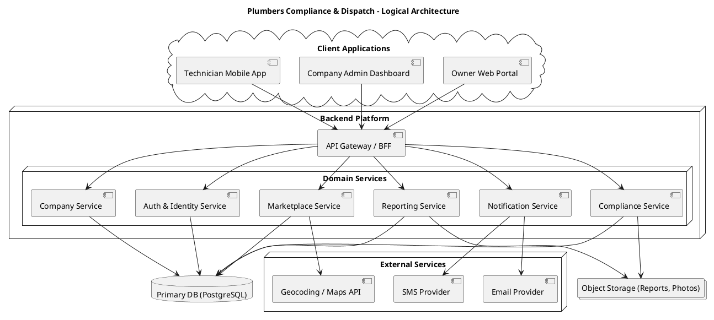
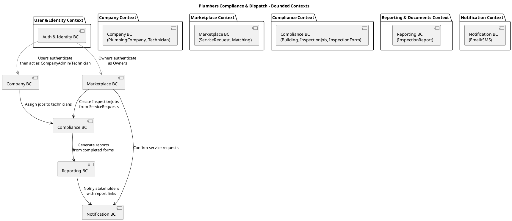

## A. Visual Architecture Diagrams (Logical + DDD Bounded Contexts)

I will give you **two complementary diagrams** in text/PlantUML form:

1. **Logical architecture** – how clients, backend services, storage, and integrations fit together.
2. **Domain/bounded context map** – how your core domains (Marketplace, Compliance, Company, etc.) relate.

You can paste these into any PlantUML-compatible renderer.

### A.1 Logical Architecture Diagram

This diagram assumes a **single codebase** with domain modules that could later be factored out into microservices if desired.

---

### A.2 Domain-Driven Design (DDD) Bounded Context Map

This shows **which domain owns which concepts**, and who depends on whom.

Key points:

* **Compliance BC** is your core domain (heart of the business).
* **Marketplace BC** and **Company BC** depend on it for actual work execution.
* **Reporting BC** is a supporting subdomain (derived artifacts).
* **Notification BC** is a generic subdomain used by several contexts.
* **Auth & Identity BC** is a generic supporting context.

These boundaries are exactly what you will mirror in code modules and services.

---

