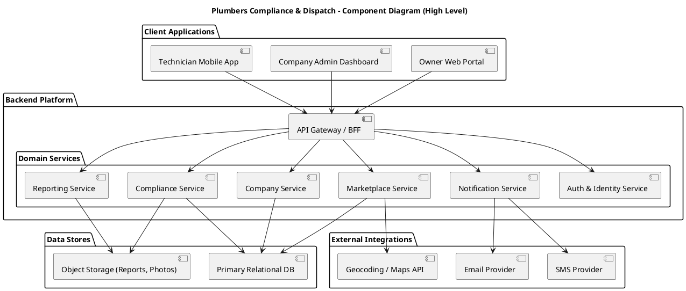
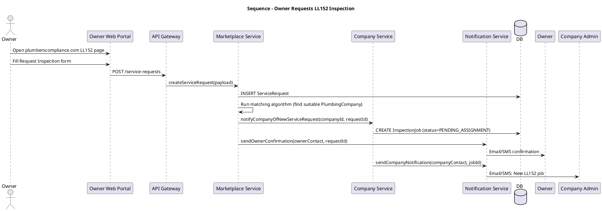
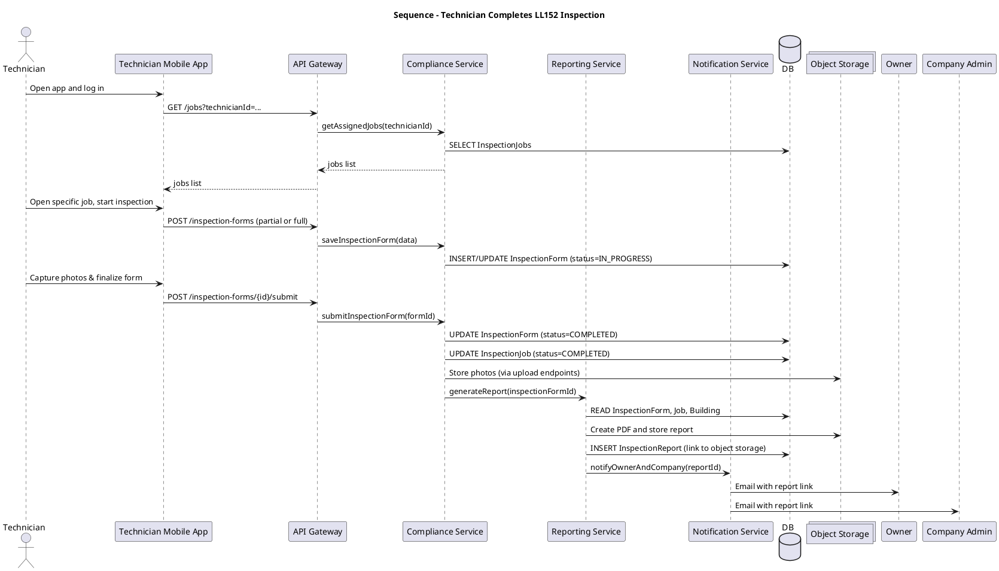
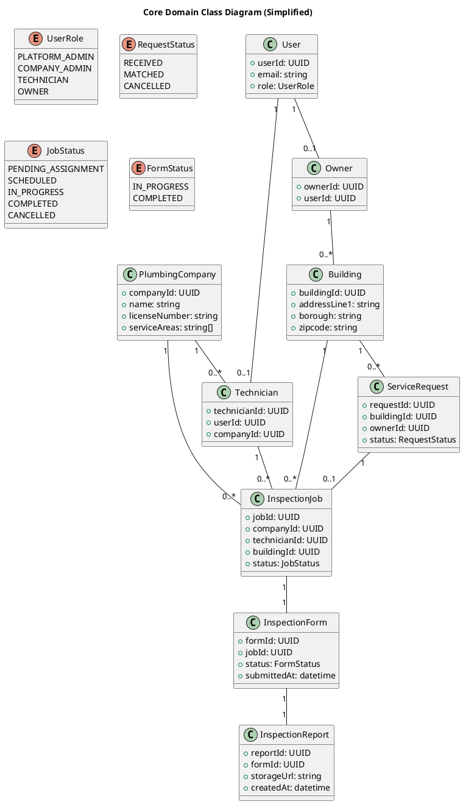

## C. System-level UML Diagrams

I will use text-based UML (PlantUML style) so you can paste it directly into tools like PlantUML, Mermaid (with small adjustments), or other UML editors.

### C.1 Component Diagram – High-Level System

This shows the main subsystems and how they interact.

This aligns with the earlier philosophy:

* **Marketplace domain** → Marketplace Service
* **Supply/company domain** → Company Service
* **Compliance domain** → Compliance & Reporting Services

---

### C.2 Sequence Diagram – “Owner Requests LL152 Inspection”

This captures the cross-boundary flow and is useful for API design and service responsibility.

Key design consequence:

* **ServiceRequest** is created first (marketplace domain), then **InspectionJob** (compliance domain) is created once a company is selected.

---

### C.3 Sequence Diagram – “Technician Completes LL152 Inspection”

This covers the technician workflow and report generation.

Design consequence:

* **InspectionForm** is the authoritative record of inspection data.
* **InspectionReport** is derived, versioned, and stored as an artifact.

---

### C.4 UML Class Diagram – Core Domain (Skeleton)

This ties directly to your ontology in section E.

---
