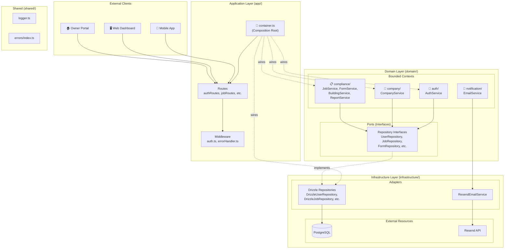
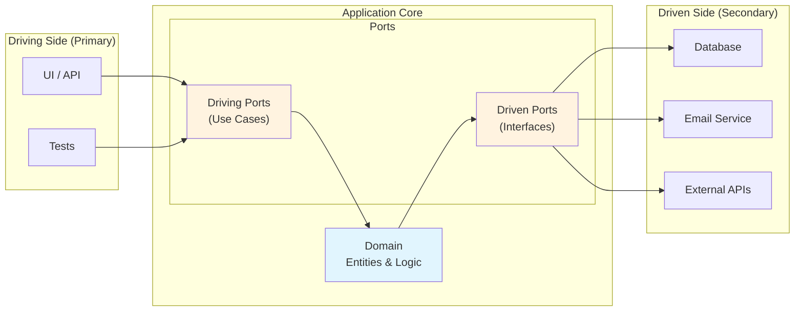
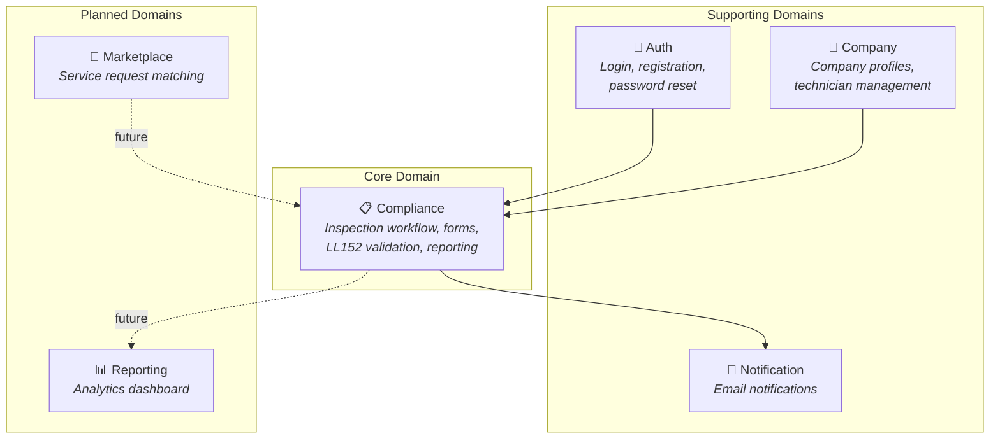
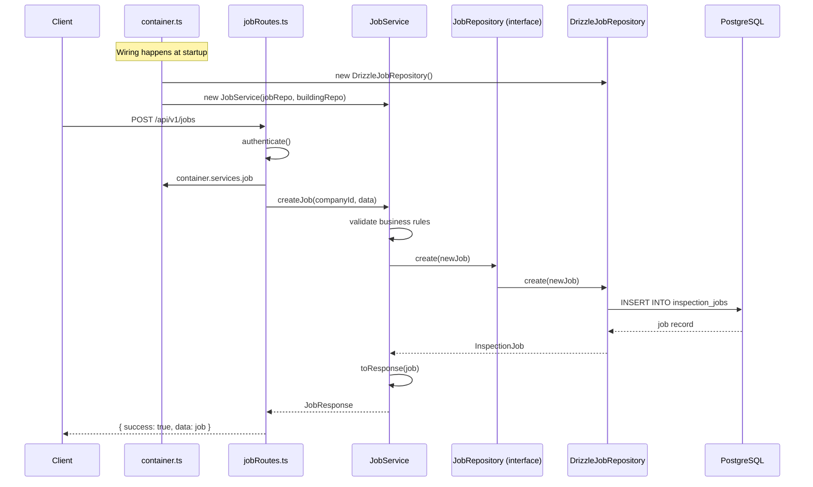
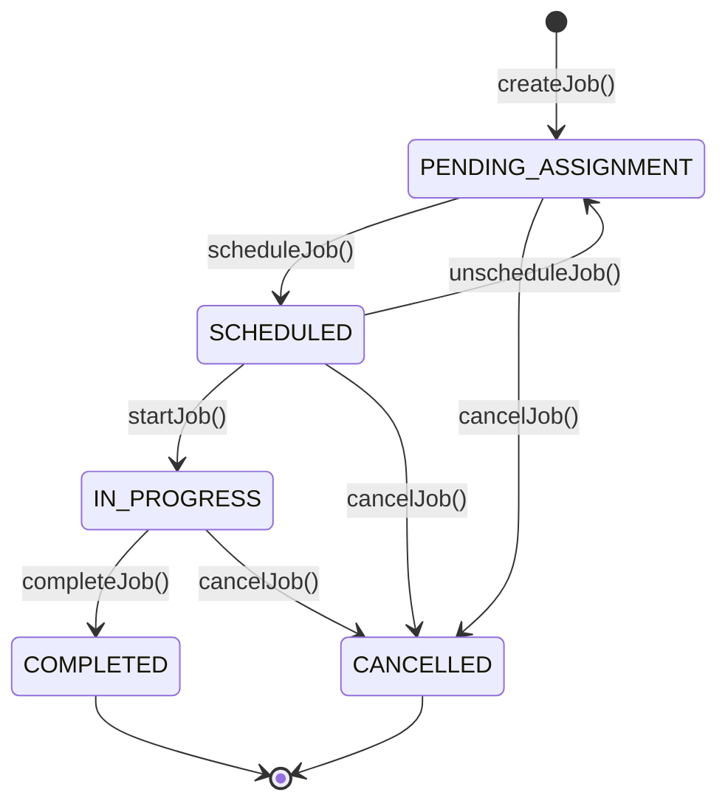

# Backend Architecture Guide

> A comprehensive guide to the backend's layered architecture and its path toward Hexagonal Architecture.

**Last Updated:** December 2024  
**Audience:** Development team, new contributors, system architects

---

## Table of Contents

1. [Architecture Overview](#architecture-overview)
2. [Current Architecture Diagram](#current-architecture-diagram)
3. [Layer Breakdown](#layer-breakdown)
4. [Hexagonal Architecture Comparison](#hexagonal-architecture-comparison)
5. [Domain Contexts](#domain-contexts)
6. [Data Flow Examples](#data-flow-examples)
7. [Gap Analysis & Technical Debt](#gap-analysis--technical-debt)
8. [Migration Path to Hexagonal](#migration-path-to-hexagonal)
9. [Quick Reference](#quick-reference)

---

## Architecture Overview

The backend follows a **Layered Architecture** with **Repository Pattern** and **Domain-Driven Design (DDD)** influences. It's approximately 80% aligned with Hexagonal Architecture (Ports & Adapters), with a centralized composition root and known technical debt from the MVP phase.

### Core Principles

| Principle | Implementation |
|-----------|----------------|
| **Separation of Concerns** | Business logic isolated in `domain/`, HTTP handling in `app/`, data access in `infrastructure/` |
| **Dependency Inversion** | Services depend on repository *interfaces*, not concrete implementations |
| **Single Responsibility** | Each service handles one bounded context (auth, compliance, etc.) |
| **Explicit Dependencies** | Services receive dependencies via constructor injection |
| **Centralized Wiring** | All dependencies wired in `src/app/container.ts` |

---

## Current Architecture Diagram



---

## Layer Breakdown

### 1. Application Layer (`src/app/`)

**Responsibility:** HTTP interface, request/response handling, routing, dependency wiring

```
app/
├── container.ts         # ⭐ Composition Root - all dependency wiring
├── server.ts           # Fastify server factory
├── config/              # Environment configuration
└── http/
    ├── middleware/
    │   ├── auth.ts          # JWT validation, role checking
    │   └── errorHandler.ts  # Global error handling
    └── routes/
        ├── index.ts         # ⭐ Routes aggregator
        ├── auth/
        │   ├── routes.ts    # /api/v1/auth/*
        │   └── routes.test.ts
        ├── bookings/
        │   ├── routes.ts    # /api/v1/booking/*
        │   └── routes.test.ts
        ├── buildings/
        │   ├── routes.ts    # /api/v1/buildings/*
        │   └── routes.test.ts
        ├── companies/
        │   ├── routes.ts    # /api/v1/companies/*
        │   └── routes.test.ts
        ├── jobs/
        │   ├── routes.ts    # /api/v1/jobs/*
        │   └── routes.test.ts
        ├── forms/
        │   ├── routes.ts    # /api/v1/jobs/:id/form
        │   └── routes.test.ts
        └── reports/
            ├── routes.ts    # /api/v1/jobs/:id/form/report
            └── routes.test.ts
```

> [!IMPORTANT]
> **Composition Root:** `container.ts` is the single authoritative source for all service and repository instances. Routes import from here instead of instantiating their own dependencies. See [Container Documentation](#composition-root-containerets) for usage.

---

### 2. Domain Layer (`src/domain/`) + Modules (`src/modules/`)

**Responsibility:** Business logic, domain rules, use-cases

> [!NOTE]
> Business logic has been migrated to **Hexagonal Modules** in `src/modules/`. The `domain/` folder retains DTOs and legacy compliance services.

#### Hexagonal Modules (Current Architecture)

```
modules/
├── auth/
│   ├── domain/              # Pure types (User, PasswordResetToken)
│   ├── ports/               # Repository interfaces
│   ├── adapters/drizzle/    # Drizzle implementations
│   ├── application/         # Use-cases (Register, Login, GetMe, etc.)
│   ├── moduleFactory.ts     # Creates module with wired dependencies
│   ├── auth.test.ts         # Module integration tests
│   └── index.ts             # Public API
│
├── company/
│   ├── domain/              # Company, Technician, CompanyAdmin types
│   ├── ports/               # Repository interfaces
│   ├── adapters/drizzle/    # Drizzle implementations
│   ├── application/         # Use-cases (CreateCompany, AddTechnician, etc.)
│   ├── moduleFactory.ts
│   ├── company.test.ts
│   └── index.ts
│
└── compliance/
    ├── domain/              # Job, Form, Building, Report types
    ├── ports/               # Repository interfaces
    ├── adapters/drizzle/    # Drizzle implementations
    ├── application/         # Use-cases organized by entity
    │   ├── jobs/            # CreateJob, GetJob, ScheduleJob, etc.
    │   ├── buildings/       # CreateBuilding, GetBuilding, etc.
    │   ├── forms/           # GetOrCreateForm, SubmitForm, ValidateForm
    │   ├── reports/         # GenerateReport, GetReport
    │   └── booking/         # CreateBooking (MVP wrapper)
    ├── moduleFactory.ts
    └── index.ts
```

#### Legacy Domain (DTOs and Compliance Services)

```
domain/
├── auth/dtos/               # Request/response schemas
├── company/dtos/            # Request/response schemas
└── compliance/
    ├── dtos/                # Job, Form, Building DTOs
    ├── schemas/ll152.ts     # NYC Local Law 152 validation rules
    └── services/            # Legacy services (used by some use-cases)
        ├── JobService.ts
        ├── FormService.ts
        ├── BuildingService.ts
        ├── ReportService.ts
        ├── BookingService.ts
        └── LL152ValidationService.ts
```

---

### 3. Infrastructure Layer (`src/infrastructure/`)

**Responsibility:** External resource implementations, database access

```
infrastructure/
├── db/
│   ├── index.ts                # Drizzle DB connection
│   ├── seed.ts                 # Test data seeding
│   ├── migrations/             # Auto-generated migrations
│   ├── repositories/           # ADAPTERS: Implement domain ports
│   │   ├── DrizzleUserRepository.ts
│   │   ├── DrizzleJobRepository.ts
│   │   ├── DrizzleFormRepository.ts
│   │   ├── DrizzleBuildingRepository.ts
│   │   ├── DrizzleOwnerRepository.ts
│   │   ├── DrizzleReportRepository.ts
│   │   ├── DrizzleCompanyRepository.ts
│   │   ├── DrizzleServiceRequestRepository.ts
│   │   └── DrizzlePasswordResetTokenRepository.ts
│   └── schema/                 # Drizzle table definitions
│       ├── users.ts
│       ├── companies.ts
│       ├── buildings.ts
│       ├── inspectionJobs.ts
│       ├── inspectionForms.ts
│       ├── inspectionReports.ts
│       ├── inspectionPhotos.ts
│       ├── owners.ts
│       ├── serviceRequests.ts
│       └── passwordResetTokens.ts
│
├── email/
│   └── ResendEmailService.ts   # ADAPTER: Resend implementation
│
├── external/                   # 🔜 Future: External API clients
├── messaging/                  # 🔜 Future: Message queues
└── storage/                    # 🔜 Future: File storage (S3, GCS)
```

---

## Composition Root (`container.ts`)

The composition root is the single place where all dependencies are wired together. This provides:

- **Visibility:** See the entire object graph in one file
- **Testability:** Swap implementations for testing
- **Consistency:** All routes use the same service instances

### Usage in Routes

```typescript
// app/http/routes/jobRoutes.ts
import { container, getCompanyIdForUser, getTechnicianIdForUser } from '../../container';

export async function jobRoutes(fastify: FastifyInstance) {
    // Get service from container instead of instantiating
    const { job: jobService } = container.services;

    fastify.post('/', async (request, reply) => {
        const companyId = await getCompanyIdForUser(user.userId, user.role);
        const job = await jobService.createJob(companyId, data);
        return reply.send({ success: true, data: job });
    });
}
```

### Container Structure

```typescript
export const container = {
    repositories: {
        user, building, job, form, report, owner,
        company, companyAdmin, technician, passwordResetToken
    },
    services: {
        company, job, form, report, building, booking
    },
    factories: {
        createAuthService  // For request-scoped dependencies (JWT signing)
    },
    infrastructure: {
        email  // Direct adapter access for edge cases
    }
};

// Helper functions for common patterns
export async function getCompanyIdForUser(userId: string, role: string): Promise<string>;
export async function getTechnicianIdForUser(userId: string): Promise<string>;
export async function getOwnerIdForUser(userId: string): Promise<string>;
```

---

## Hexagonal Architecture Comparison

### Hexagonal Architecture Concepts



### Our Implementation vs Hexagonal

| Hexagonal Concept | Our Implementation | Status |
|-------------------|-------------------|--------|
| **Driving Ports** (Use Cases) | Route handlers call services directly | ⚠️ Implicit |
| **Driving Adapters** | Fastify routes (`app/http/routes/`) | ✅ Present |
| **Domain Core** | `domain/*/services/` | ✅ Present |
| **Driven Ports** (Interfaces) | `domain/*/repositories/` | ✅ Present |
| **Driven Adapters** | `infrastructure/db/repositories/` | ✅ Present |
| **Pure Domain Entities** | Types from `infrastructure/db/schema/` | ⚠️ Leaking |
| **Dependency Injection** | Centralized in `container.ts` | ✅ Present |
| **Composition Root** | `src/app/container.ts` | ✅ Implemented |

---

## Domain Contexts



### Bounded Context Rules

1. **Compliance** is the core domain - other domains support it
2. Each domain has its own DTOs (no shared DTOs across domains)
3. Cross-domain communication happens through services, not repositories
4. Future domains should follow the same pattern

---

## Data Flow Examples

### Example: Creating an Inspection Job



### Example: Job State Transitions



---

## Gap Analysis & Technical Debt

### Resolved ✅

- **Composition Root:** `container.ts` now centralizes all wiring
- **Route Wiring:** `jobRoutes.ts` refactored to use container (other routes pending)

### Remaining Gaps

#### 1. Domain Types Leak Infrastructure

```typescript
// ❌ CURRENT: JobRepository.ts imports from infrastructure
import { InspectionJob, NewInspectionJob } from '../../../infrastructure/db/schema/inspectionJobs';

export interface JobRepository {
    create(data: NewInspectionJob): Promise<InspectionJob>;
}
```

**Impact:** Domain layer is coupled to Drizzle schema types.

#### 2. Route Migration Incomplete

Only `jobRoutes.ts` has been migrated to use the container. Other routes still instantiate adapters locally:
- `authRoutes.ts` - uses factory pattern (needs special handling for JWT)
- `companyRoutes.ts`
- `buildingRoutes.ts`
- `formRoutes.ts`
- `reportRoutes.ts`
- `bookingRoutes.ts`

#### 3. No Explicit Use Case Layer

Services combine use cases with domain logic. In pure Hexagonal, use cases (driving ports) would be separate from domain services.

---

## Migration Path to Hexagonal

### ✅ Phase 2: Composition Root (COMPLETED)

Created `src/app/container.ts` with centralized wiring. Refactored `jobRoutes.ts` as proof of concept.

### Phase 1: Pure Domain Entities (Next Priority)

Create domain entities decoupled from Drizzle:

```
domain/compliance/entities/
├── Job.ts           # Pure domain entity
├── Form.ts
├── Building.ts
└── types.ts         # Shared types
```

```typescript
// domain/compliance/entities/Job.ts
export interface Job {
    id: string;
    companyId: string;
    buildingId: string;
    status: JobStatus;
    scheduledDate?: Date;
    technicianId?: string;
    createdAt: Date;
    updatedAt: Date;
}
```

### Phase 2b: Migrate Remaining Routes

Refactor remaining route files to use container:

```typescript
// Before (scattered wiring)
const companyRepository = new DrizzleCompanyRepository();
const companyService = new CompanyService(companyRepository, ...);

// After (centralized)
const { company: companyService } = container.services;
```

### Phase 3: Explicit Use Cases (Future)

For complex flows, introduce use case classes:

```typescript
// domain/compliance/usecases/ScheduleJobUseCase.ts
export class ScheduleJobUseCase {
    constructor(
        private jobRepository: JobRepository,
        private technicianRepository: TechnicianRepository,
        private notificationService: NotificationService
    ) {}

    async execute(request: ScheduleJobRequest): Promise<Job> {
        // Orchestrate multiple services
    }
}
```

---

## Quick Reference

### File Location Guide

| What You Need | Where to Find It |
|---------------|------------------|
| **Dependency wiring** | `src/app/container.ts` |
| API endpoints | `src/app/http/routes/*.ts` |
| Business logic | `src/domain/*/services/*.ts` |
| Repository interfaces | `src/domain/*/repositories/*.ts` |
| Repository implementations | `src/infrastructure/db/repositories/*.ts` |
| Database schema | `src/infrastructure/db/schema/*.ts` |
| Validation schemas | `src/domain/*/dtos/*.ts`, `src/domain/*/schemas/*.ts` |
| Error types | `src/shared/errors/index.ts` |

### Adding a New Feature Checklist

1. [ ] Define DTO in `domain/[context]/dtos/`
2. [ ] Define repository interface in `domain/[context]/repositories/` (if needed)
3. [ ] Implement business logic in `domain/[context]/services/`
4. [ ] Implement repository in `infrastructure/db/repositories/` (if needed)
5. [ ] **Wire in container** - add instances to `src/app/container.ts`
6. [ ] Add route in `app/http/routes/` using container imports
7. [ ] Add unit tests for service
8. [ ] Update API documentation

### Related Documentation

- [Start Here](../README.md) - Documentation index
- [Repository Pattern](./REPOSITORY_PATTERN.md)
- [Job State Machine](./JOB_STATE_MACHINE.md)
- [Access Control](./ACCESS_CONTROL.md)
- [LL152 Validation](./LL152_VALIDATION.md)
- [JWT Token Strategy](./JWT_TOKEN_STRATEGY.md)

---

## Summary

| Aspect | Current State | Target State |
|--------|---------------|--------------|
| **Architecture Style** | Layered + Repository Pattern | Hexagonal (Ports & Adapters) |
| **Domain Purity** | 70% (schema type leakage) | 100% (pure entities) |
| **Dependency Injection** | ✅ Composition Root | Fully migrated routes |
| **Testability** | Good (mockable interfaces) | Excellent (isolated domain) |
| **Flexibility** | Can swap DB adapters | Can swap any adapter |

The current architecture is **production-ready** and **maintainable**. The composition root is now in place, and remaining routes can be migrated incrementally without breaking changes.
