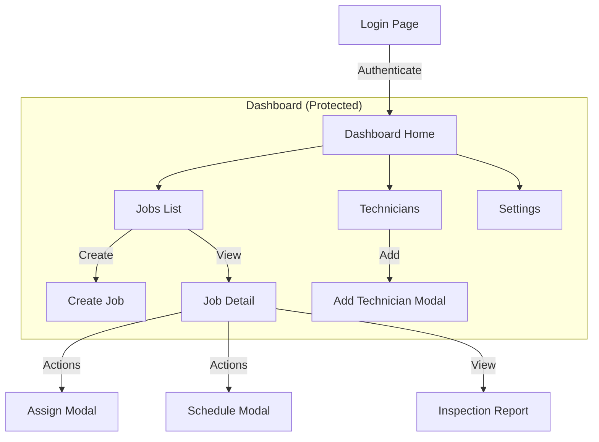
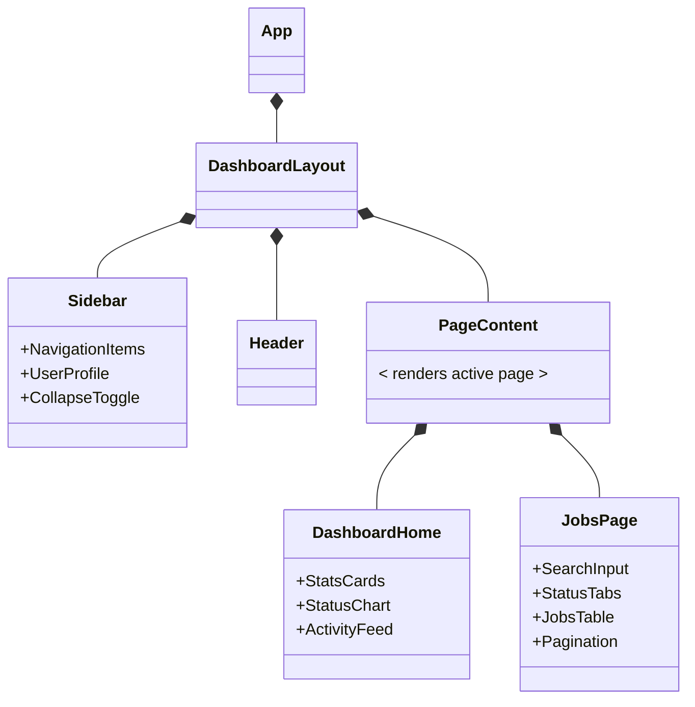
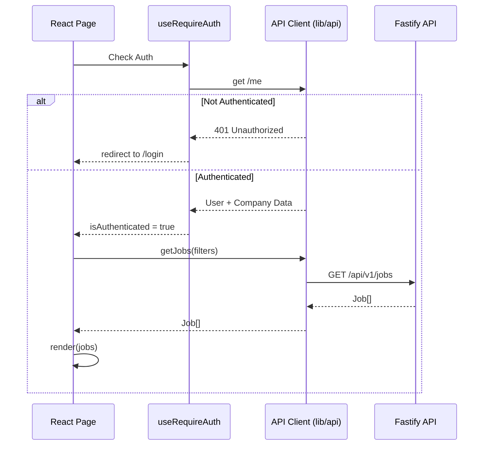
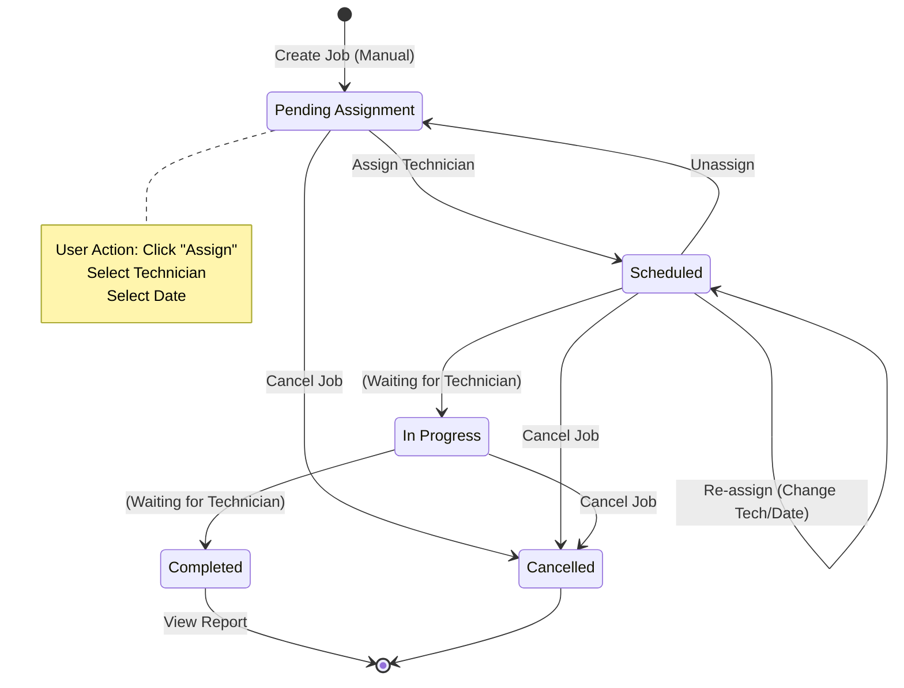
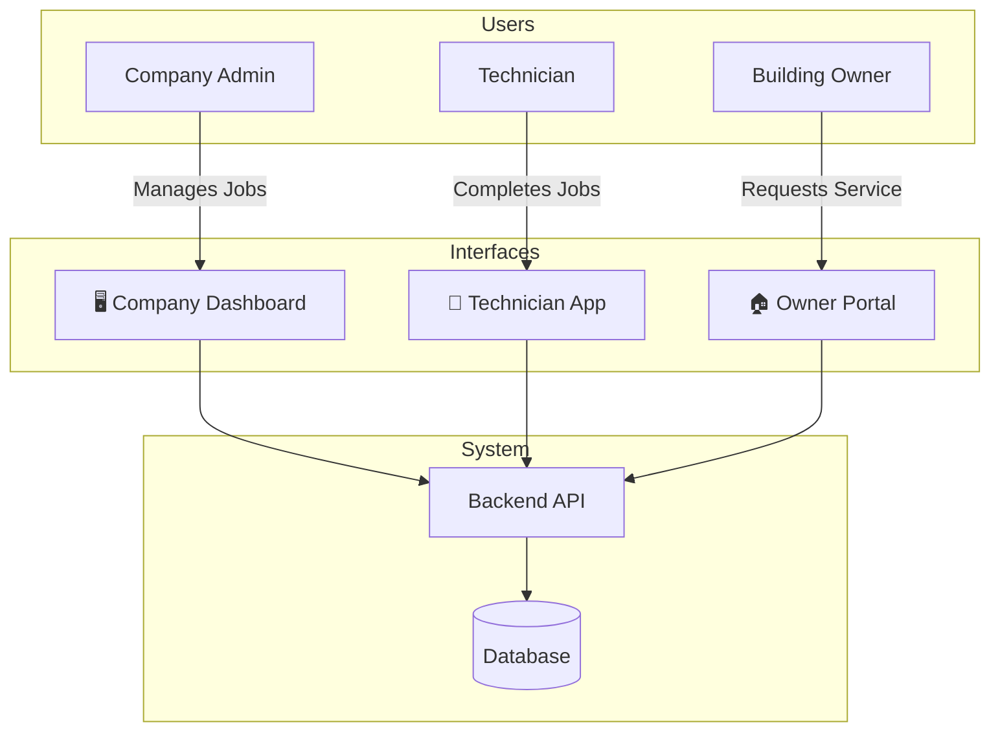

# Dashboard Visual Documentation

> Visual architecture snapshots and user flows for the Company Dashboard.
> Optimized for agent context and architectural understanding.

---

## 1. Information Architecture (Navigation Map)

Visualizes the structure of the dashboard application.

---

## 2. Component Hierarchy (Planned)

Visualizes the layout and component structure for the planned redesign.

---

## 3. Data Fetching & Auth Flow

Visualizes how the frontend retrieves data and handles authentication state.

---

## 4. Job Management User Flow

Visualizes the user actions available at each stage of the job lifecycle from the dashboard perspective.

---

## 5. System Context (Apps & Users)

Visualizes how the Company Dashboard fits into the broader ecosystem.

