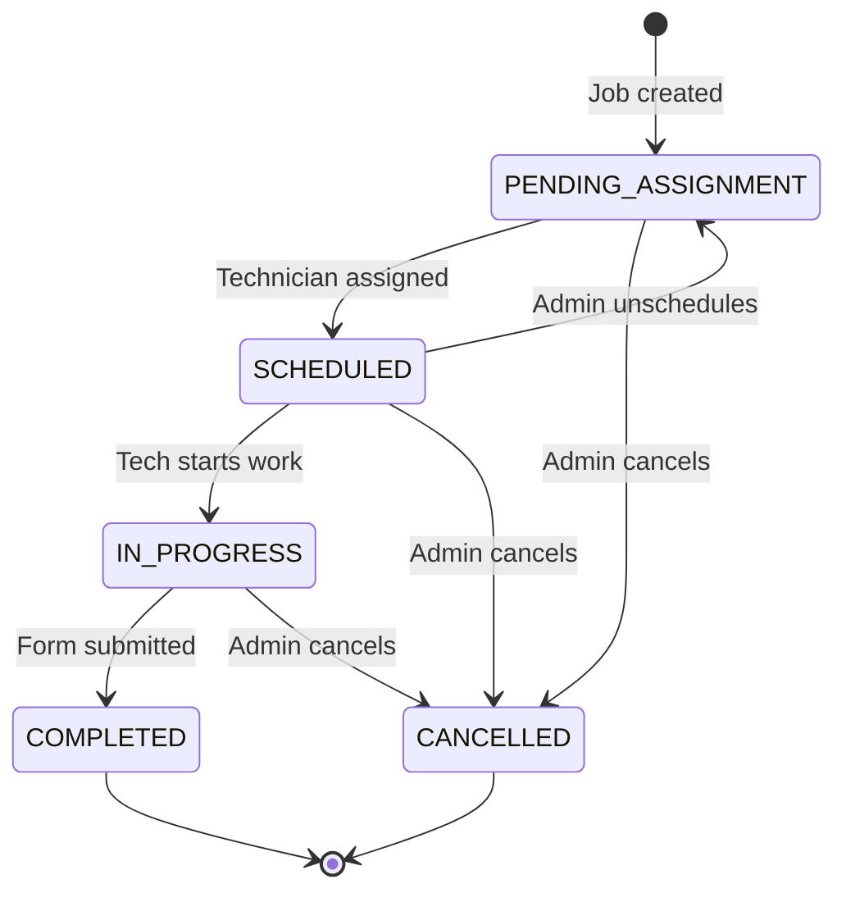

# Job State Machine

> Core business logic for inspection job lifecycle

## State Diagram



---

## States Explained

| State | Business Meaning | Who Sets It |
|-------|-----------------|-------------|
| `PENDING_ASSIGNMENT` | Job exists but no technician | System (on create) |
| `SCHEDULED` | Technician assigned, date set | Company Admin |
| `IN_PROGRESS` | Technician is at property, working | Technician |
| `COMPLETED` | Inspection done, form submitted | Technician |
| `CANCELLED` | Job cancelled before completion | Company Admin |

---

## Transition Rules

### Legal Transitions

```typescript
const ALLOWED_TRANSITIONS: Record<JobStatus, JobStatus[]> = {
  PENDING_ASSIGNMENT: ['SCHEDULED', 'CANCELLED'],
  SCHEDULED: ['IN_PROGRESS', 'PENDING_ASSIGNMENT', 'CANCELLED'],
  IN_PROGRESS: ['COMPLETED', 'CANCELLED'],
  COMPLETED: [],  // Terminal state
  CANCELLED: [],  // Terminal state
};
```

### Transition Guards

| Transition | Guard Condition |
|------------|-----------------|
| → SCHEDULED | Must have `technicianId` |
| → IN_PROGRESS | Must be assigned tech calling |
| → COMPLETED | Form must be submitted first |
| → CANCELLED | Cannot cancel COMPLETED jobs |

---

## Code Location

| File | Responsibility |
|------|----------------|
| [modules/compliance/application/jobs/](file:///c:/github/pcd/apps/backend/src/modules/compliance/application/jobs/) | UseCase handlers (transition logic) |
| [jobs/routes.ts](file:///c:/github/pcd/apps/backend/src/app/http/routes/jobs/routes.ts) | HTTP endpoints |
| [inspectionJobs.ts](file:///c:/github/pcd/apps/backend/src/infrastructure/db/schema/inspectionJobs.ts) | Database schema |

> **Note**: After the hexagonal refactor, state machine logic moved from a single `JobService.ts` to individual UseCases (`StartJobUseCase`, `CompleteJobUseCase`, etc.).

---

## Adding New States

1. **Add to enum** in `inspectionJobs.ts`:
   ```typescript
   export const jobStatusEnum = pgEnum('job_status', [
     'PENDING_ASSIGNMENT',
     'SCHEDULED',
     'IN_PROGRESS',
     'COMPLETED',
     'CANCELLED',
     'YOUR_NEW_STATE',  // Add here
   ]);
   ```

2. **Update transitions** in `JobService.ts`:
   ```typescript
   private getAllowedTransitions(current: JobStatus): JobStatus[] {
     // Add YOUR_NEW_STATE rules
   }
   ```

3. **Add endpoint** in `jobRoutes.ts` if needed

4. **Run migration**: `pnpm --filter @pcd/backend db:push`

---

## Common Pitfalls

> [!CAUTION]
> Never bypass state transitions. Always call `JobService.transition()` instead of directly updating the database status field.

> [!WARNING]
> The `COMPLETED` state is immutable. Once a job is completed, it cannot be changed. This is intentional for audit compliance.
