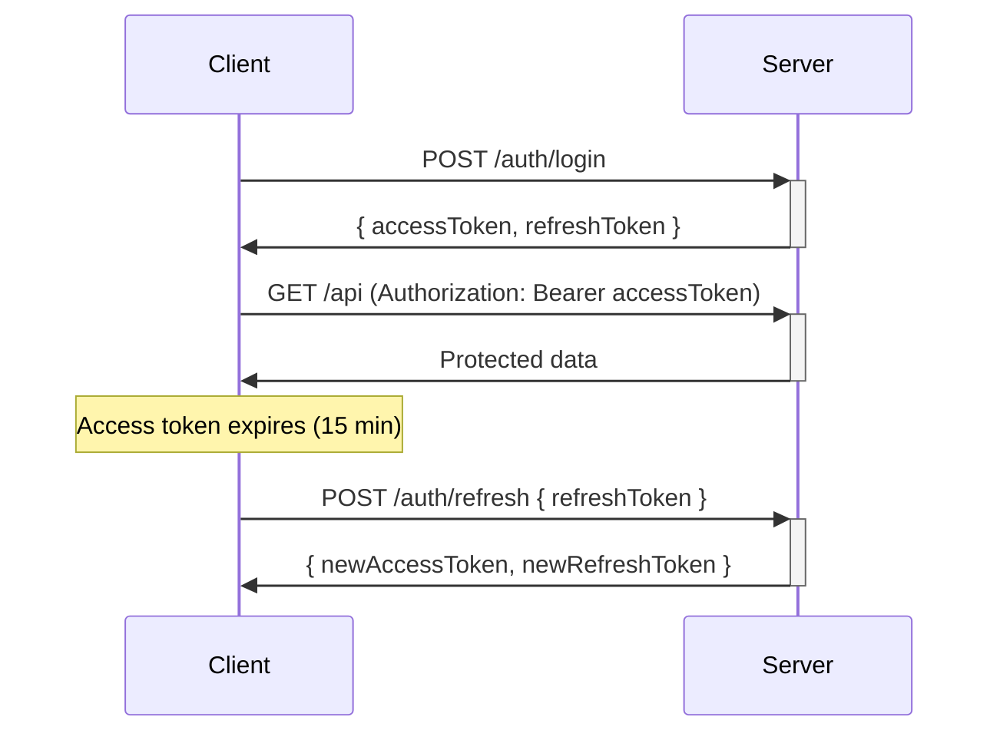

# JWT Token Strategy

> Authentication tokens and session management

## Token Types

| Token | Purpose | Expiry | Stored Where |
|-------|---------|--------|--------------|
| Access Token | API authentication | 15 min | Client memory |
| Refresh Token | Get new access token | 7 days | Client storage |
| Password Reset | One-time reset link | 30 min | Database |

---

## Token Payload

```typescript
interface TokenPayload {
  userId: string;
  email: string;
  role: 'PLATFORM_ADMIN' | 'COMPANY_ADMIN' | 'TECHNICIAN' | 'OWNER';
  companyId?: string;      // Set for COMPANY_ADMIN, TECHNICIAN
  technicianId?: string;   // Set for TECHNICIAN
  ownerId?: string;        // Set for OWNER
}
```

---

## Token Flow



---

## Configuration

Environment variables:
```bash
JWT_SECRET=your-secret-key
JWT_ACCESS_EXPIRY=15m      # Access token lifetime
JWT_REFRESH_EXPIRY=7d      # Refresh token lifetime
```

---

## MVP Limitations

> [!WARNING]
> **Refresh tokens are stateless** - cannot be revoked on logout.
> 
> For production, implement:
> 1. Store refresh tokens in `refresh_tokens` table
> 2. Check token exists and `is_revoked = false` on /refresh
> 3. Delete/revoke on logout

---

## Code Location

| File | Responsibility |
|------|----------------|
| [AuthService.ts](file:///c:/github/pcd/apps/backend/src/domain/auth/services/AuthService.ts) | Token generation |
| [authRoutes.ts](file:///c:/github/pcd/apps/backend/src/app/http/routes/authRoutes.ts) | /login, /refresh endpoints |
| [auth.ts](file:///c:/github/pcd/apps/backend/src/app/http/middleware/auth.ts) | Token verification |
